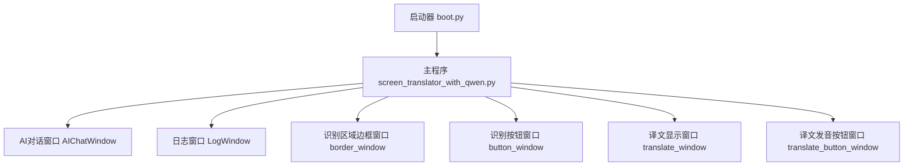
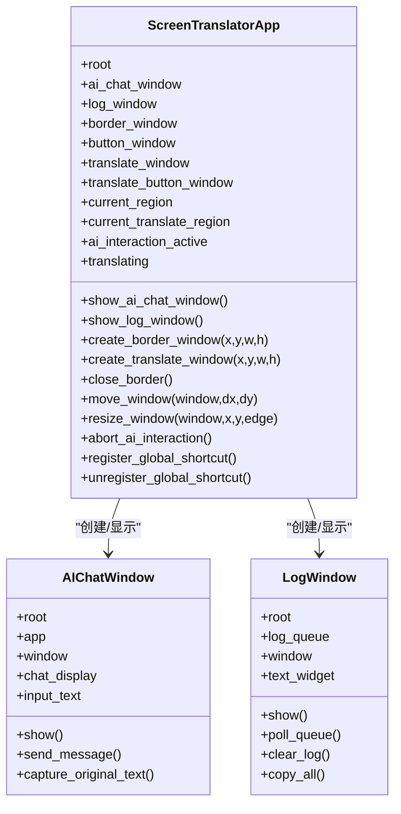
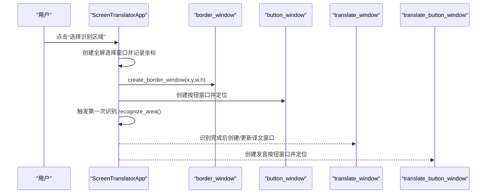
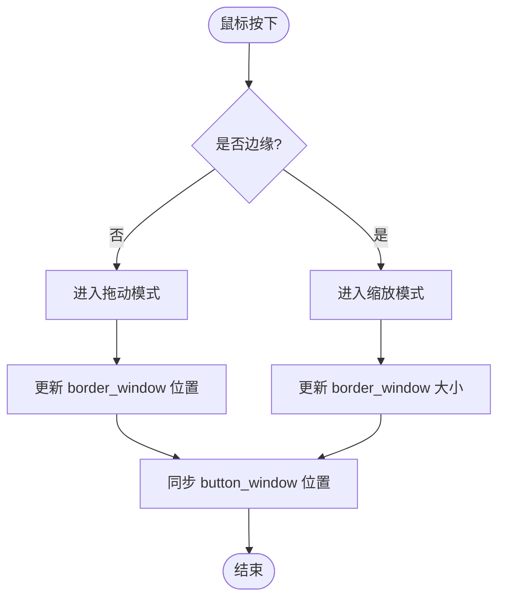
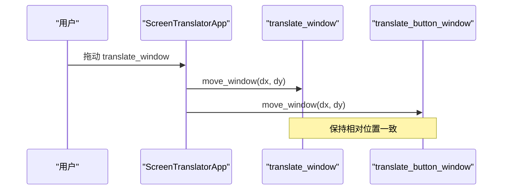
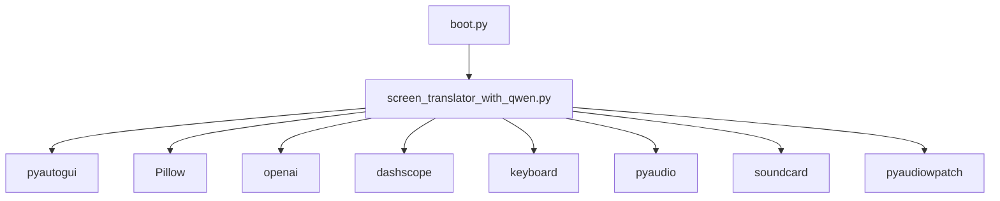

# 多窗口协调

<cite>
**本文引用的文件**
- [screen_translator_with_qwen.py](file://screen_translator_with_qwen.py)
- [boot.py](file://boot.py)
- [requirements.txt](file://requirements.txt)
</cite>

## 目录
1. [简介](#简介)
2. [项目结构](#项目结构)
3. [核心组件](#核心组件)
4. [架构总览](#架构总览)
5. [详细组件分析](#详细组件分析)
6. [依赖关系分析](#依赖关系分析)
7. [性能与资源管理](#性能与资源管理)
8. [故障排查指南](#故障排查指南)
9. [结论](#结论)
10. [附录](#附录)

## 简介
本技术文档围绕“多窗口协调系统”展开，重点解释主控制器 ScreenTranslatorApp 如何管理与协调多个子窗口（如 AIChatWindow、LogWindow）的生命周期、状态同步、层级控制、资源清理以及跨窗口通信。同时提供调试技巧与性能监控建议，帮助读者在复杂 UI 场景下构建稳定、可维护的多窗口应用。

## 项目结构
- 启动器 boot.py：负责自动检测目标脚本、管理虚拟环境、以无控制台方式启动主程序。
- 主程序 screen_translator_with_qwen.py：实现屏幕翻译、OCR/翻译调用、语音合成与播放、全局快捷键、多窗口管理等核心功能。
- requirements.txt：声明运行所需依赖库。

图表来源
- [boot.py:256-279](file://boot.py#L256-L279)
- [screen_translator_with_qwen.py:474-634](file://screen_translator_with_qwen.py#L474-L634)
- [screen_translator_with_qwen.py:101-300](file://screen_translator_with_qwen.py#L101-L300)
- [screen_translator_with_qwen.py:34-100](file://screen_translator_with_qwen.py#L34-L100)
- [screen_translator_with_qwen.py:859-926](file://screen_translator_with_qwen.py#L859-L926)
- [screen_translator_with_qwen.py:714-780](file://screen_translator_with_qwen.py#L714-L780)

章节来源
- [boot.py:256-279](file://boot.py#L256-L279)
- [screen_translator_with_qwen.py:474-634](file://screen_translator_with_qwen.py#L474-L634)
- [requirements.txt:1-31](file://requirements.txt#L1-L31)

## 核心组件
- ScreenTranslatorApp：主控制器，负责创建和管理所有子窗口、处理用户交互、调度后台任务、维护窗口状态与位置同步、注册全局快捷键、管理音频与临时文件等。
- AIChatWindow：独立的 AI 对话窗口，支持发送消息、捕获原文、错误提示与结果展示。
- LogWindow：独立日志窗口，通过队列异步消费日志并滚动显示。

章节来源
- [screen_translator_with_qwen.py:474-634](file://screen_translator_with_qwen.py#L474-L634)
- [screen_translator_with_qwen.py:101-300](file://screen_translator_with_qwen.py#L101-L300)
- [screen_translator_with_qwen.py:34-100](file://screen_translator_with_qwen.py#L34-L100)

## 架构总览
主控制器作为中心枢纽，持有各子窗口的实例引用，并通过方法调用和事件回调进行协调。关键流程包括：
- 窗口创建与显示：按需创建 Toplevel 子窗口，设置置顶、透明度、无边框等属性。
- 生命周期管理：统一销毁入口，确保关联窗口与资源释放。
- 状态同步：拖动/缩放时联动更新相关窗口位置与尺寸。
- 层级管理：使用 -topmost 与 overrideredirect 控制 z-order 与焦点行为。
- 资源清理：关闭时清理临时文件、停止线程、注销全局快捷键。

图表来源
- [screen_translator_with_qwen.py:474-634](file://screen_translator_with_qwen.py#L474-L634)
- [screen_translator_with_qwen.py:101-300](file://screen_translator_with_qwen.py#L101-L300)
- [screen_translator_with_qwen.py:34-100](file://screen_translator_with_qwen.py#L34-L100)

## 详细组件分析

### 主控制器 ScreenTranslatorApp 的窗口管理
- 初始化阶段：
  - 注册程序退出清理函数，绑定主窗口关闭事件。
  - 初始化界面元素与状态变量，包含识别区域、译文区域、AI 交互标志、快捷键句柄等。
  - 预置 LogWindow 实例，供后续显示。
- 子窗口创建与显示：
  - AI 对话窗口：首次创建后缓存引用，再次显示时直接 deiconify 并 lift。
  - 日志窗口：通过 show 方法检查存在性，必要时重建并轮询队列。
  - 识别区域边框窗口与按钮窗口：根据选择区域坐标创建无边框置顶窗口，并在右上角或下方放置控制按钮窗口。
  - 译文显示窗口与发音按钮窗口：根据译文区域坐标创建，按钮窗口动态计算位置以避免超出屏幕边界。
- 窗口生命周期：
  - close_border 统一销毁识别与译文相关的所有窗口，重置状态与按钮可用性。
  - on_window_close 清理临时文件并销毁主窗口。
- 窗口状态同步：
  - move_window / resize_window 在移动/缩放时更新当前区域坐标，并联动更新按钮窗口位置。
  - 针对 translate_window 的拖动，会同步移动 translate_button_window，保持相对位置一致。
- 层级与焦点：
  - 使用 overrideredirect(True) 去除标题栏，配合 attributes('-topmost', True) 置顶。
  - 主窗口未置顶，避免干扰其他应用；辅助窗口置顶保证可见性与交互性。
- 资源清理：
  - atexit 与 WM_DELETE_WINDOW 双重保障清理临时语音文件。
  - 全局快捷键在切换或退出前注销，防止残留监听。
  - 后台线程采用 daemon=True，避免阻塞进程退出。

章节来源
- [screen_translator_with_qwen.py:474-634](file://screen_translator_with_qwen.py#L474-L634)
- [screen_translator_with_qwen.py:2397-2416](file://screen_translator_with_qwen.py#L2397-L2416)
- [screen_translator_with_qwen.py:859-926](file://screen_translator_with_qwen.py#L859-L926)
- [screen_translator_with_qwen.py:714-780](file://screen_translator_with_qwen.py#L714-L780)
- [screen_translator_with_qwen.py:1410-1441](file://screen_translator_with_qwen.py#L1410-L1441)
- [screen_translator_with_qwen.py:1649-1703](file://screen_translator_with_qwen.py#L1649-L1703)
- [screen_translator_with_qwen.py:1704-1723](file://screen_translator_with_qwen.py#L1704-L1723)
- [screen_translator_with_qwen.py:1753-1788](file://screen_translator_with_qwen.py#L1753-L1788)

#### 窗口创建与显示序列

图表来源
- [screen_translator_with_qwen.py:781-858](file://screen_translator_with_qwen.py#L781-L858)
- [screen_translator_with_qwen.py:859-926](file://screen_translator_with_qwen.py#L859-L926)
- [screen_translator_with_qwen.py:927-1021](file://screen_translator_with_qwen.py#L927-L1021)
- [screen_translator_with_qwen.py:714-780](file://screen_translator_with_qwen.py#L714-L780)

#### 窗口拖拽与缩放同步流程

图表来源
- [screen_translator_with_qwen.py:1268-1309](file://screen_translator_with_qwen.py#L1268-L1309)
- [screen_translator_with_qwen.py:1311-1408](file://screen_translator_with_qwen.py#L1311-L1408)

#### 译文窗口与按钮窗口联动

图表来源
- [screen_translator_with_qwen.py:1585-1600](file://screen_translator_with_qwen.py#L1585-L1600)
- [screen_translator_with_qwen.py:1649-1654](file://screen_translator_with_qwen.py#L1649-L1654)

### AIChatWindow 窗口
- 生命周期：
  - show 方法优先复用已存在窗口，否则新建并居中显示。
  - 内部维护聊天历史文本控件与输入框，支持快捷键发送。
- 数据共享：
  - 通过 app 引用访问 ocr_cache，实现“捕获原文”功能。
- 错误处理：
  - 对 API 客户端未初始化、认证失败、限流等情况进行友好提示。

章节来源
- [screen_translator_with_qwen.py:101-300](file://screen_translator_with_qwen.py#L101-L300)
- [screen_translator_with_qwen.py:2397-2402](file://screen_translator_with_qwen.py#L2397-L2402)

### LogWindow 窗口
- 生命周期：
  - show 方法检查窗口是否存在，不存在则创建并配置滚动文本控件与操作按钮。
  - poll_queue 周期性从队列取日志并追加到文本控件。
- 事件与交互：
  - 清空日志与复制全部功能。
- 线程安全：
  - 使用 after 在主线程中更新 UI，避免跨线程调用 Tk 控件。

章节来源
- [screen_translator_with_qwen.py:34-100](file://screen_translator_with_qwen.py#L34-L100)
- [screen_translator_with_qwen.py:2403-2406](file://screen_translator_with_qwen.py#L2403-L2406)

## 依赖关系分析
- 启动器 boot.py 负责：
  - 自动检测唯一 .py 目标脚本。
  - 校验与重建虚拟环境，增量更新依赖。
  - 以无控制台方式启动目标程序。
- 主程序依赖：
  - pyautogui 截图、Pillow 图像处理、openai 与 dashscope 调用 AI 服务、keyboard 全局快捷键、pyaudio 音频播放、soundcard/pyaudiowpatch 系统音频录制等。

图表来源
- [boot.py:256-279](file://boot.py#L256-L279)
- [requirements.txt:1-31](file://requirements.txt#L1-L31)

章节来源
- [boot.py:256-279](file://boot.py#L256-L279)
- [requirements.txt:1-31](file://requirements.txt#L1-L31)

## 性能与资源管理
- 线程模型：
  - OCR/翻译、语音合成与播放、听歌识曲等耗时任务均在后台线程执行，避免阻塞 UI。
  - 使用 root.after(0, ...) 将 UI 更新调度回主线程，保证线程安全。
- 资源清理策略：
  - 程序退出时清理临时语音文件；关闭识别/译文窗口时销毁对应窗口对象并重置状态。
  - 全局快捷键在切换或退出前注销，避免残留监听导致异常。
  - 后台线程设置为守护线程，确保进程退出时不会卡住。
- 性能优化建议：
  - 图像压缩与灰度化减少网络传输体积。
  - 合理设置窗口透明度与无边框，降低渲染开销。
  - 批量 UI 更新时使用 after 合并多次刷新，减少重绘次数。

章节来源
- [screen_translator_with_qwen.py:927-1021](file://screen_translator_with_qwen.py#L927-L1021)
- [screen_translator_with_qwen.py:1098-1121](file://screen_translator_with_qwen.py#L1098-L1121)
- [screen_translator_with_qwen.py:1410-1441](file://screen_translator_with_qwen.py#L1410-L1441)
- [screen_translator_with_qwen.py:1753-1788](file://screen_translator_with_qwen.py#L1753-L1788)

## 故障排查指南
- 常见问题定位：
  - AI 客户端未初始化：检查 key.txt 是否正确配置。
  - 请求频繁限制：遇到 429 错误时等待指数退避时间后重试。
  - 系统音频录制失败：按提示启用立体声混音或安装 pyaudiowpatch。
- 调试技巧：
  - 使用内置日志窗口查看实时日志输出。
  - 通过状态标签观察当前任务状态（识别中、翻译中、播放中等）。
  - 利用快捷键快速触发重新识别，验证窗口联动逻辑。
- 性能监控：
  - 关注网络请求重试与延迟，评估 OCR/翻译响应时间。
  - 监控临时文件生成与删除，避免磁盘占用增长。
  - 观察窗口拖动/缩放时的帧率与卡顿情况，适当调整灵敏度与刷新频率。

章节来源
- [screen_translator_with_qwen.py:1123-1247](file://screen_translator_with_qwen.py#L1123-L1247)
- [screen_translator_with_qwen.py:1789-1851](file://screen_translator_with_qwen.py#L1789-L1851)
- [screen_translator_with_qwen.py:2373-2396](file://screen_translator_with_qwen.py#L2373-L2396)

## 结论
本多窗口协调系统以 ScreenTranslatorApp 为核心，统一管理 AIChatWindow、LogWindow 及识别/译文相关窗口，实现了完整的生命周期控制、状态同步、层级管理与资源清理。通过合理的线程模型与 UI 更新策略，系统在复杂交互场景下保持了良好的稳定性与用户体验。结合日志窗口与快捷键机制，开发者可以高效地进行调试与性能监控。

## 附录
- 启动器使用说明：
  - 将主程序放在与 boot.py 同级目录，双击启动即可自动管理环境与依赖。
- 依赖安装：
  - 若需手动安装，参考 requirements.txt 中的版本约束。

章节来源
- [boot.py:256-279](file://boot.py#L256-L279)
- [requirements.txt:1-31](file://requirements.txt#L1-L31)