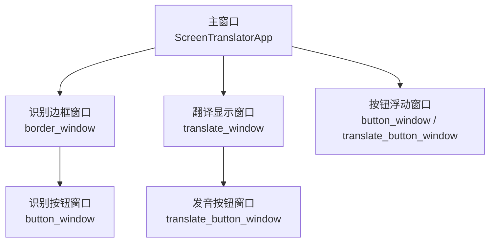
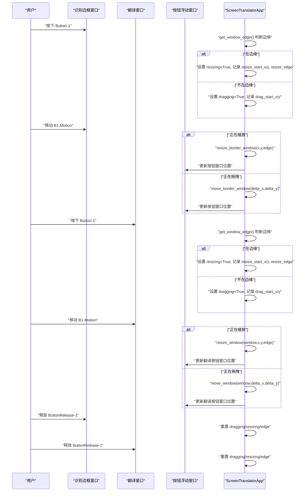
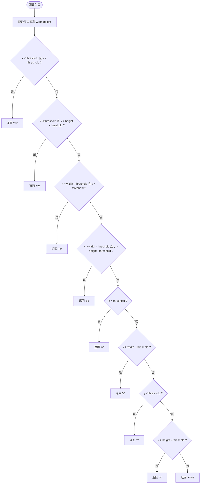
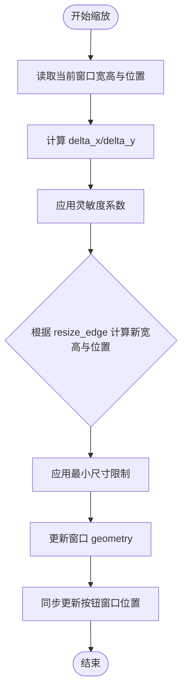
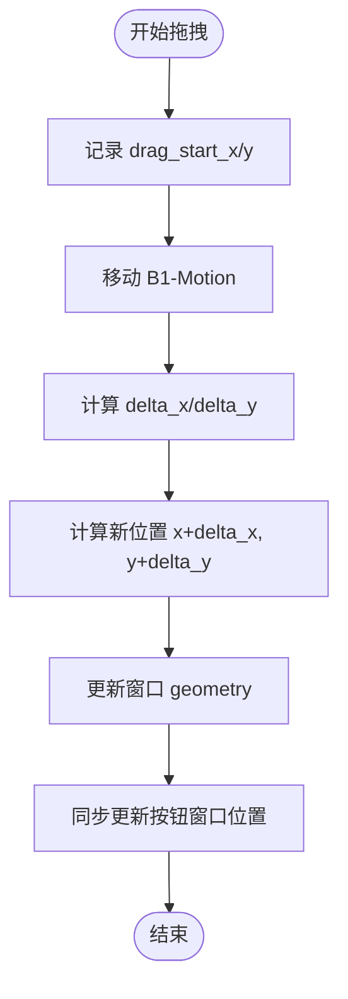
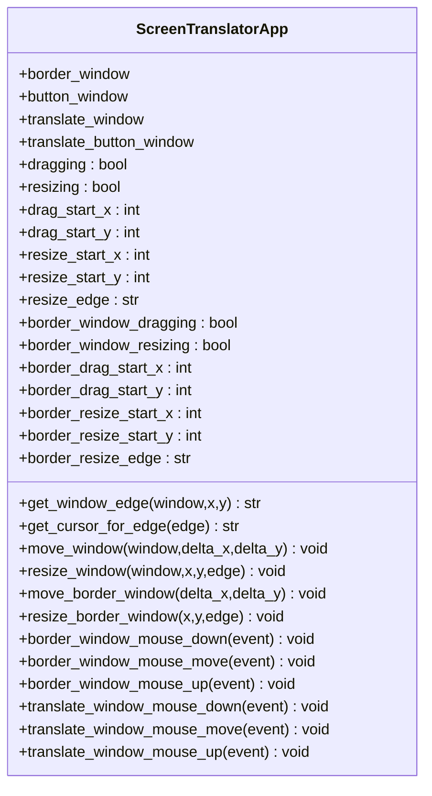

# 窗口拖拽与调整

<cite>
**本文引用的文件**   
- [screen_translator_with_qwen.py](file://screen_translator_with_qwen.py)
</cite>

## 目录
1. [简介](#简介)
2. [项目结构](#项目结构)
3. [核心组件](#核心组件)
4. [架构总览](#架构总览)
5. [详细组件分析](#详细组件分析)
6. [依赖关系分析](#依赖关系分析)
7. [性能考虑](#性能考虑)
8. [故障排除指南](#故障排除指南)
9. [结论](#结论)

## 简介
本技术文档聚焦于屏幕翻译工具中的“窗口拖拽与调整”功能，围绕以下目标展开：
- 鼠标事件处理机制：Button-1、B1-Motion、ButtonRelease-1 的绑定与处理逻辑
- 窗口边界检测算法：边缘识别、边界判断与拖拽方向确定
- 动态尺寸调整：resize_start_x/y 坐标记录、resize_edge 边缘标记、实时尺寸计算
- 窗口位置跟踪：drag_start_x/y 初始位置记录与移动过程中的坐标更新
- 多窗口协调：主窗口、翻译窗口、按钮窗口的相对位置管理
- 性能优化建议：事件节流与重绘优化
- 故障排除与用户体验改进

## 项目结构
本项目为单文件应用，主要实现位于 screen_translator_with_qwen.py。该文件包含：
- 主界面与应用状态管理
- 区域选择（全屏半透明覆盖层）
- 识别边框窗口（可拖拽/可调大小）
- 翻译显示窗口（可拖拽/可调大小）
- 控制按钮浮动窗口（跟随识别/翻译窗口）
- AI 交互、语音合成、听歌识曲等辅助功能

图表来源
- [screen_translator_with_qwen.py:859-926](file://screen_translator_with_qwen.py#L859-L926)
- [screen_translator_with_qwen.py:714-780](file://screen_translator_with_qwen.py#L714-L780)

章节来源
- [screen_translator_with_qwen.py:474-634](file://screen_translator_with_qwen.py#L474-L634)
- [screen_translator_with_qwen.py:859-926](file://screen_translator_with_qwen.py#L859-L926)
- [screen_translator_with_qwen.py:714-780](file://screen_translator_with_qwen.py#L714-L780)

## 核心组件
- 鼠标事件绑定与分发
  - 识别边框窗口：绑定 Button-1、B1-Motion、ButtonRelease-1、Leave
  - 翻译窗口：同样绑定上述事件以支持拖拽与缩放
- 边界检测与光标反馈
  - get_window_edge：基于窗口宽高与阈值判定鼠标是否处于边缘或角点
  - get_cursor_for_edge：根据边缘返回对应系统光标
- 拖拽与缩放
  - 拖拽：记录 drag_start_x/y 或 border_drag_start_x/y，按 delta 更新 geometry
  - 缩放：记录 resize_start_x/y 与 resize_edge，按边缘方向计算新宽高与左上角坐标
- 多窗口联动
  - 拖动/缩放识别窗口时同步更新按钮窗口位置
  - 拖动/缩放翻译窗口时同步更新发音按钮窗口位置

章节来源
- [screen_translator_with_qwen.py:1268-1310](file://screen_translator_with_qwen.py#L1268-L1310)
- [screen_translator_with_qwen.py:1570-1610](file://screen_translator_with_qwen.py#L1570-L1610)
- [screen_translator_with_qwen.py:1611-1647](file://screen_translator_with_qwen.py#L1611-L1647)
- [screen_translator_with_qwen.py:1311-1409](file://screen_translator_with_qwen.py#L1311-L1409)
- [screen_translator_with_qwen.py:1649-1703](file://screen_translator_with_qwen.py#L1649-L1703)

## 架构总览
下图展示了拖拽与调整的核心调用链与数据流。

图表来源
- [screen_translator_with_qwen.py:1268-1310](file://screen_translator_with_qwen.py#L1268-L1310)
- [screen_translator_with_qwen.py:1311-1409](file://screen_translator_with_qwen.py#L1311-L1409)
- [screen_translator_with_qwen.py:1570-1610](file://screen_translator_with_qwen.py#L1570-L1610)
- [screen_translator_with_qwen.py:1649-1703](file://screen_translator_with_qwen.py#L1649-L1703)

## 详细组件分析

### 鼠标事件处理机制
- 识别边框窗口
  - 按下：border_window_mouse_down(event)
    - 通过 get_window_edge 判断是否在边缘；若是则进入缩放模式，否则进入拖拽模式
    - 记录起始坐标：resize_start_x/y 或 drag_start_x/y
  - 移动：border_window_mouse_move(event)
    - 若缩放：调用 resize_border_window
    - 若拖拽：调用 move_border_window
    - 否则：根据 get_window_edge 切换光标
  - 释放：border_window_mouse_up(event)
    - 重置 dragging/resizing/edge
  - 离开：border_window_mouse_leave(event)
    - 恢复默认光标
- 翻译窗口
  - 按下：translate_window_mouse_down(event)
    - 同识别窗口逻辑，使用 resize_start_x/y、resize_edge、dragging 等变量
  - 移动：translate_window_mouse_move(event)
    - 缩放：resize_window
    - 拖拽：move_window，并同步更新翻译按钮窗口位置
  - 释放：translate_window_mouse_up(event)
    - 重置相关状态
  - 离开：translate_window_mouse_leave(event)
    - 恢复默认光标

章节来源
- [screen_translator_with_qwen.py:1268-1310](file://screen_translator_with_qwen.py#L1268-L1310)
- [screen_translator_with_qwen.py:1570-1610](file://screen_translator_with_qwen.py#L1570-L1610)

### 窗口边界检测算法
- 输入：窗口对象、鼠标相对坐标 (x, y)
- 步骤：
  - 获取窗口宽高 width、height
  - 设定边缘阈值 edge_threshold（例如 10 像素）
  - 判断顺序：
    - 四角：nw、sw、ne、se
    - 四边：w、e、n、s
    - 内部：返回 None
- 输出：边缘标识字符串（如 "nw"、"e"、None）
- 复杂度：O(1)，仅若干比较操作

图表来源
- [screen_translator_with_qwen.py:1611-1633](file://screen_translator_with_qwen.py#L1611-L1633)

章节来源
- [screen_translator_with_qwen.py:1611-1633](file://screen_translator_with_qwen.py#L1611-L1633)

### 动态尺寸调整的实现原理
- 关键变量
  - resize_start_x/y：缩放开始时的鼠标坐标
  - resize_edge：当前缩放的边缘标记（nw/sw/ne/se/w/e/n/s）
- 计算流程
  - 计算 delta_x/delta_y = 当前鼠标坐标 - 起始坐标
  - 引入灵敏度系数（例如 0.1），降低缩放抖动
  - 根据 resize_edge 决定 new_width/new_height/new_x/new_y 的变化规则：
    - e/se/ne：宽度增加
    - s/se/sw：高度增加
    - w/sw/nw：宽度减少，同时 x 左移
    - n/nw/ne：高度减少，同时 y 上移
  - 设置最小尺寸限制（例如宽度≥50/100，高度≥20/50）
  - 更新窗口 geometry，并联动更新按钮窗口位置
- 复杂度：O(1)

图表来源
- [screen_translator_with_qwen.py:1349-1409](file://screen_translator_with_qwen.py#L1349-L1409)
- [screen_translator_with_qwen.py:1655-1703](file://screen_translator_with_qwen.py#L1655-L1703)

章节来源
- [screen_translator_with_qwen.py:1349-1409](file://screen_translator_with_qwen.py#L1349-L1409)
- [screen_translator_with_qwen.py:1655-1703](file://screen_translator_with_qwen.py#L1655-L1703)

### 窗口位置跟踪系统
- 关键变量
  - drag_start_x/y 或 border_drag_start_x/y：拖拽开始时的鼠标坐标
- 计算流程
  - 计算 delta_x/delta_y = 当前鼠标坐标 - 起始坐标
  - 新位置 = 原位置 + delta
  - 更新窗口 geometry（仅位置，不改变宽高）
  - 同步更新关联按钮窗口位置
- 复杂度：O(1)

图表来源
- [screen_translator_with_qwen.py:1311-1348](file://screen_translator_with_qwen.py#L1311-L1348)
- [screen_translator_with_qwen.py:1649-1654](file://screen_translator_with_qwen.py#L1649-L1654)

章节来源
- [screen_translator_with_qwen.py:1311-1348](file://screen_translator_with_qwen.py#L1311-L1348)
- [screen_translator_with_qwen.py:1649-1654](file://screen_translator_with_qwen.py#L1649-L1654)

### 多窗口协调机制
- 识别窗口与按钮窗口
  - 创建时根据识别区域坐标计算按钮窗口位置（优先上方，不足则下方，再不足则放入区域内顶部）
  - 拖动/缩放识别窗口后，重新计算并更新按钮窗口位置
- 翻译窗口与发音按钮窗口
  - 创建时根据翻译窗口坐标计算发音按钮窗口位置（策略同上）
  - 拖动/缩放翻译窗口后，同步更新发音按钮窗口位置
- 关闭清理
  - 关闭识别窗口时，同时关闭翻译窗口与发音按钮窗口，确保资源释放

章节来源
- [screen_translator_with_qwen.py:859-926](file://screen_translator_with_qwen.py#L859-L926)
- [screen_translator_with_qwen.py:714-780](file://screen_translator_with_qwen.py#L714-L780)
- [screen_translator_with_qwen.py:1311-1409](file://screen_translator_with_qwen.py#L1311-L1409)
- [screen_translator_with_qwen.py:1410-1441](file://screen_translator_with_qwen.py#L1410-L1441)

## 依赖关系分析
- 模块内依赖
  - ScreenTranslatorApp 类集中管理所有窗口实例与状态
  - 事件回调方法直接调用边界检测、移动、缩放等方法
- 外部库
  - tkinter：窗口与事件处理
  - pyautogui：截图（与拖拽无关）
  - openai/dashscope：AI 与语音合成（与拖拽无关）
- 耦合与内聚
  - 拖拽/缩放逻辑集中在 ScreenTranslatorApp 中，内聚性良好
  - 多窗口联动通过显式几何更新实现，耦合度适中

图表来源
- [screen_translator_with_qwen.py:474-634](file://screen_translator_with_qwen.py#L474-L634)
- [screen_translator_with_qwen.py:1268-1310](file://screen_translator_with_qwen.py#L1268-L1310)
- [screen_translator_with_qwen.py:1570-1610](file://screen_translator_with_qwen.py#L1570-L1610)
- [screen_translator_with_qwen.py:1611-1647](file://screen_translator_with_qwen.py#L1611-L1647)
- [screen_translator_with_qwen.py:1311-1409](file://screen_translator_with_qwen.py#L1311-L1409)
- [screen_translator_with_qwen.py:1649-1703](file://screen_translator_with_qwen.py#L1649-L1703)

章节来源
- [screen_translator_with_qwen.py:474-634](file://screen_translator_with_qwen.py#L474-L634)
- [screen_translator_with_qwen.py:1268-1310](file://screen_translator_with_qwen.py#L1268-L1310)
- [screen_translator_with_qwen.py:1570-1610](file://screen_translator_with_qwen.py#L1570-L1610)
- [screen_translator_with_qwen.py:1611-1647](file://screen_translator_with_qwen.py#L1611-L1647)
- [screen_translator_with_qwen.py:1311-1409](file://screen_translator_with_qwen.py#L1311-L1409)
- [screen_translator_with_qwen.py:1649-1703](file://screen_translator_with_qwen.py#L1649-L1703)

## 性能考虑
- 事件节流
  - 当前实现未对 B1-Motion 进行节流，高频移动可能导致频繁 geometry 更新
  - 建议：使用 after 或时间戳采样，将事件频率限制到约 30–60Hz
- 重绘优化
  - 每次 geometry 更新会触发重绘，建议在批量更新后统一刷新
  - 对于翻译窗口文本 wraplength 的动态更新，可减少不必要的 update_idletasks 调用
- 透明度与层级
  - 识别边框窗口设置了低透明度，可能影响渲染性能；可在拖拽结束后恢复默认值
- 最小尺寸与灵敏度
  - 合理的最小尺寸与灵敏度可降低无效更新次数，提升流畅度

[本节为通用指导，无需具体文件引用]

## 故障排除指南
- 无法拖拽或缩放
  - 检查是否在边缘：确认 get_window_edge 返回值是否符合预期
  - 检查状态标志：dragging/resizing 是否正确重置
- 按钮窗口位置异常
  - 检查屏幕高度与边界判断逻辑，确保按钮窗口不会超出屏幕
- 翻译窗口文本换行不正确
  - 检查 wraplength 是否与窗口宽度一致，避免内容溢出
- 卡顿或延迟
  - 评估 B1-Motion 事件频率，必要时加入节流
  - 减少 update_idletasks 的使用，仅在必要时强制刷新

章节来源
- [screen_translator_with_qwen.py:1611-1633](file://screen_translator_with_qwen.py#L1611-L1633)
- [screen_translator_with_qwen.py:1311-1409](file://screen_translator_with_qwen.py#L1311-L1409)
- [screen_translator_with_qwen.py:1688-1703](file://screen_translator_with_qwen.py#L1688-L1703)

## 结论
本项目的窗口拖拽与调整功能通过清晰的鼠标事件绑定、高效的边界检测算法以及稳健的多窗口联动机制，实现了良好的交互体验。通过对事件节流与重绘优化的进一步改进，可显著提升在高 DPI 或多显示器环境下的流畅度与稳定性。

[本节为总结，无需具体文件引用]