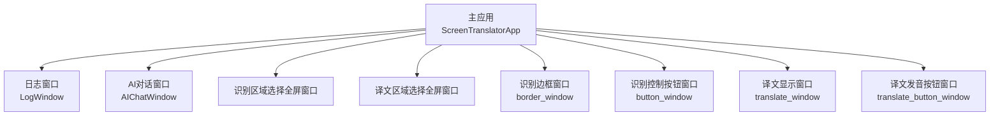
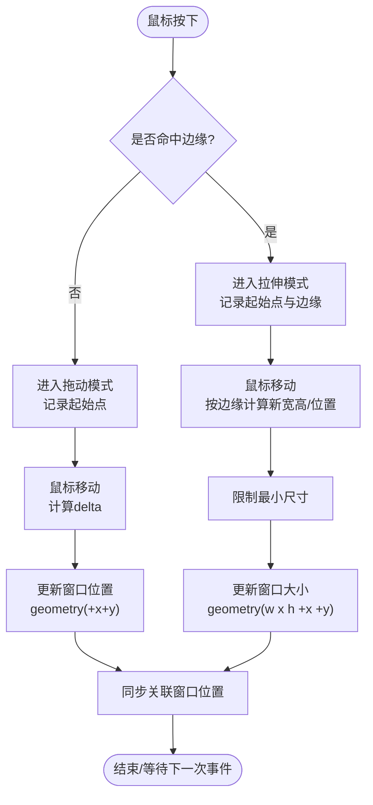
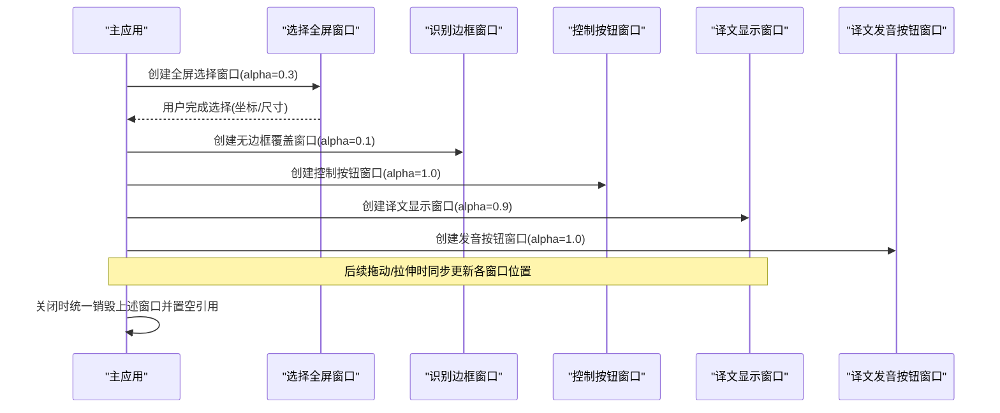
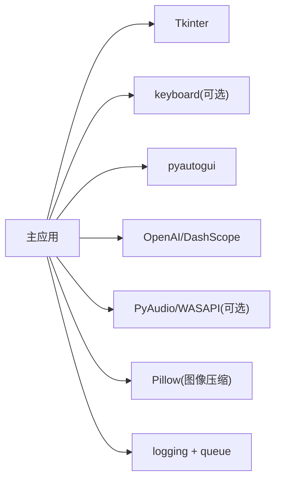

# 窗口管理

<cite>
**本文引用的文件**   
- [screen_translator_with_qwen.py](file://screen_translator_with_qwen.py)
- [test/screen_translaor_2.0.py](file://test/screen_translaor_2.0.py)
- [test/label_transparent.py](file://test/label_transparent.py)
- [test/topmost_window_test.py](file://test/topmost_window_test.py)
- [test/overlay_fullscreen_game.py](file://test/overlay_fullscreen_game.py)
</cite>

## 目录
1. [简介](#简介)
2. [项目结构](#项目结构)
3. [核心组件](#核心组件)
4. [架构总览](#架构总览)
5. [详细组件分析](#详细组件分析)
6. [依赖关系分析](#依赖关系分析)
7. [性能考虑](#性能考虑)
8. [故障排除指南](#故障排除指南)
9. [结论](#结论)
10. [附录](#附录)

## 简介
本文件围绕“屏幕翻译工具”的窗口管理系统进行深入文档化，重点覆盖以下方面：
- 透明窗口效果的实现原理（Tkinter 属性、alpha 透明度、跨平台注意事项）
- 拖拽与拉伸调整的实现机制（鼠标事件处理、边界检测、动态尺寸更新）
- 多窗口协调机制（主窗口与子窗口的生命周期管理与资源清理）
- 窗口状态管理（位置记忆、大小恢复、显示状态同步）
- 性能优化建议（重绘优化、内存管理、事件处理效率）
- 故障排除与最佳实践

## 项目结构
本项目采用单进程 Tkinter 应用，包含多个辅助窗口（日志窗口、AI对话窗口、识别区域边框窗口、译文显示窗口、按钮浮动窗口等）。核心逻辑集中在主应用类中，负责创建、调度、销毁各类子窗口，并维护全局状态。



图表来源
- [screen_translator_with_qwen.py:474-630](file://screen_translator_with_qwen.py#L474-L630)
- [screen_translator_with_qwen.py:635-713](file://screen_translator_with_qwen.py#L635-L713)
- [screen_translator_with_qwen.py:714-780](file://screen_translator_with_qwen.py#L714-L780)
- [screen_translator_with_qwen.py:859-926](file://screen_translator_with_qwen.py#L859-L926)

章节来源
- [screen_translator_with_qwen.py:474-630](file://screen_translator_with_qwen.py#L474-L630)

## 核心组件
- 主应用 ScreenTranslatorApp：负责界面初始化、窗口创建、事件绑定、状态管理、线程调度、快捷键注册、音频播放与语音合成入口。
- 日志窗口 LogWindow：独立 Toplevel，基于队列轮询刷新日志文本。
- AI对话窗口 AIChatWindow：独立 Toplevel，支持发送消息、捕获原文、异步调用大模型。
- 识别区域选择器：全屏半透明 Canvas，用于框选屏幕区域。
- 译文区域选择器：全屏半透明 Canvas，用于框选译文展示区域。
- 识别边框窗口 border_window：覆盖选定区域的无边框窗口，提供拖动与拉伸能力。
- 控制按钮窗口 button_window：跟随识别区域定位的悬浮按钮窗口。
- 译文显示窗口 translate_window：无边框、置顶、可拖拽拉伸的透明文本展示窗口。
- 译文发音按钮窗口 translate_button_window：悬浮在译文窗口附近，触发语音合成与播放。

章节来源
- [screen_translator_with_qwen.py:34-100](file://screen_translator_with_qwen.py#L34-L100)
- [screen_translator_with_qwen.py:101-300](file://screen_translator_with_qwen.py#L101-L300)
- [screen_translator_with_qwen.py:635-713](file://screen_translator_with_qwen.py#L635-L713)
- [screen_translator_with_qwen.py:714-780](file://screen_translator_with_qwen.py#L714-L780)
- [screen_translator_with_qwen.py:859-926](file://screen_translator_with_qwen.py#L859-L926)

## 架构总览
整体为“主窗口 + 多个功能型 Toplevel 子窗口”的架构。主窗口负责业务编排，子窗口各自承载特定交互（选择区域、显示结果、控制操作）。所有子窗口均通过主应用实例持有引用，便于统一生命周期管理。

```mermaid
classDiagram
class ScreenTranslatorApp {
+root
+log_window
+ai_chat_window
+select_window
+translate_select_window
+border_window
+button_window
+translate_window
+translate_button_window
+current_region
+current_translate_region
+dragging / resizing
+show_log_window()
+show_ai_chat_window()
+select_area()
+create_border_window(x,y,w,h)
+create_translate_window(x,y,w,h)
+move_window(window,dx,dy)
+resize_window(window,x,y,edge)
+close_border()
}
class LogWindow {
+window
+text_widget
+show()
+poll_queue()
+clear_log()
+copy_all()
}
class AIChatWindow {
+window
+chat_display
+input_text
+show()
+send_message()
+capture_original_text()
}
ScreenTranslatorApp --> LogWindow : "创建/显示"
ScreenTranslatorApp --> AIChatWindow : "创建/显示"
ScreenTranslatorApp --> "Toplevel(选择/边框/按钮/译文)" : "管理"
```

图表来源
- [screen_translator_with_qwen.py:474-630](file://screen_translator_with_qwen.py#L474-L630)
- [screen_translator_with_qwen.py:34-100](file://screen_translator_with_qwen.py#L34-L100)
- [screen_translator_with_qwen.py:101-300](file://screen_translator_with_qwen.py#L101-L300)

## 详细组件分析

### 透明窗口效果实现
- 顶层窗口置顶与透明
  - 使用 attributes('-topmost', True) 将窗口置于最前。
  - 使用 attributes('-alpha', value) 设置透明度（Windows/macOS 支持良好；Linux 需 WM 支持）。
  - 使用 overrideredirect(True) 去除标题栏，配合自定义绘制或背景色实现无边框外观。
- 选择区域全屏蒙版
  - 全屏 Toplevel + alpha 低透明度 + 黑色背景，Canvas 绘制矩形选择框。
- 无边框内容窗口
  - 无边框 + 置顶 + 高透明度，适合浮层显示文本或控件。
- 跨平台注意
  - Linux 下某些桌面环境不支持 alpha，需要回退到不透明或仅使用 topmost。
  - 游戏全屏场景建议使用 WinAPI 叠加样式（见 overlay_fullscreen_game.py），避免被遮挡。

章节来源
- [screen_translator_with_qwen.py:498-500](file://screen_translator_with_qwen.py#L498-L500)
- [screen_translator_with_qwen.py:643-648](file://screen_translator_with_qwen.py#L643-L648)
- [screen_translator_with_qwen.py:723-728](file://screen_translator_with_qwen.py#L723-L728)
- [screen_translator_with_qwen.py:868-872](file://screen_translator_with_qwen.py#L868-L872)
- [test/overlay_fullscreen_game.py:110-119](file://test/overlay_fullscreen_game.py#L110-L119)

### 拖拽与拉伸调整机制
- 边缘检测
  - get_window_edge 根据鼠标坐标与窗口宽高判断处于哪个边或角（nw/n/e/s/w/ne/se/sw）。
- 光标反馈
  - get_cursor_for_edge 返回对应方向的光标形状，提升交互体验。
- 拖动流程
  - Button-1 按下记录起点，B1-Motion 移动时计算 delta，调用 move_window 更新 geometry。
- 拉伸流程
  - 若命中边缘则进入 resize 模式，按不同边计算新宽高与左上角坐标，限制最小尺寸，调用 resize_window 更新 geometry。
- 联动更新
  - 拖动/拉伸时同步更新关联窗口（如按钮窗口跟随识别区域），并更新当前区域缓存 current_region。



图表来源
- [screen_translator_with_qwen.py:1268-1304](file://screen_translator_with_qwen.py#L1268-L1304)
- [screen_translator_with_qwen.py:1311-1409](file://screen_translator_with_qwen.py#L1311-L1409)
- [screen_translator_with_qwen.py:1611-1702](file://screen_translator_with_qwen.py#L1611-L1702)

章节来源
- [screen_translator_with_qwen.py:1268-1304](file://screen_translator_with_qwen.py#L1268-L1304)
- [screen_translator_with_qwen.py:1311-1409](file://screen_translator_with_qwen.py#L1311-L1409)
- [screen_translator_with_qwen.py:1611-1702](file://screen_translator_with_qwen.py#L1611-L1702)

### 多窗口协调机制
- 主窗口与子窗口关系
  - 主应用持有各子窗口引用，确保唯一性与可控性。
  - 显示前先检查 winfo_exists，避免重复创建。
- 生命周期控制
  - 关闭时统一销毁相关窗口并置空引用，防止悬垂对象。
  - 选择完成后立即销毁选择用全屏窗口。
- 资源清理策略
  - close_border 集中清理识别区与译文区相关窗口及状态。
  - 程序退出时清理临时音频文件。



图表来源
- [screen_translator_with_qwen.py:635-713](file://screen_translator_with_qwen.py#L635-L713)
- [screen_translator_with_qwen.py:714-780](file://screen_translator_with_qwen.py#L714-L780)
- [screen_translator_with_qwen.py:859-926](file://screen_translator_with_qwen.py#L859-L926)
- [screen_translator_with_qwen.py:1410-1441](file://screen_translator_with_qwen.py#L1410-L1441)

章节来源
- [screen_translator_with_qwen.py:635-713](file://screen_translator_with_qwen.py#L635-L713)
- [screen_translator_with_qwen.py:714-780](file://screen_translator_with_qwen.py#L714-L780)
- [screen_translator_with_qwen.py:859-926](file://screen_translator_with_qwen.py#L859-L926)
- [screen_translator_with_qwen.py:1410-1441](file://screen_translator_with_qwen.py#L1410-L1441)

### 窗口状态管理
- 位置与大小
  - 拖动/拉伸后更新 current_region 与 current_translate_region，保证后续识别/显示使用最新几何信息。
- 显示状态同步
  - 按钮窗口随识别/译文窗口移动而重新计算位置，避免超出屏幕边界。
- 快捷键与全局交互
  - 使用 keyboard 库注册全局快捷键，触发重新识别，无需窗口聚焦。
- 置顶保持
  - 对部分窗口周期性 lift/attributes('-topmost', True)，或在 WinAPI 模式下强制置顶。

章节来源
- [screen_translator_with_qwen.py:1311-1409](file://screen_translator_with_qwen.py#L1311-L1409)
- [screen_translator_with_qwen.py:1649-1702](file://screen_translator_with_qwen.py#L1649-L1702)
- [screen_translator_with_qwen.py:1753-1788](file://screen_translator_with_qwen.py#L1753-L1788)
- [test/topmost_window_test.py:74-77](file://test/topmost_window_test.py#L74-L77)
- [test/overlay_fullscreen_game.py:121-126](file://test/overlay_fullscreen_game.py#L121-L126)

### 滚动与长文本显示
- 译文窗口内嵌 Canvas + Frame + Label，支持滚轮滚动。
- 监听 <Configure> 更新 scrollregion，确保内容变化后滚动区域正确。
- 窗口拉伸时动态更新 wraplength 与 scrollregion，避免文本溢出。

章节来源
- [test/screen_translaor_2.0.py:234-277](file://test/screen_translaor_2.0.py#L234-L277)
- [screen_translator_with_qwen.py:1688-1702](file://screen_translator_with_qwen.py#L1688-L1702)

### 透明与置顶的跨平台差异
- Windows/macOS：alpha 与 topmost 行为稳定。
- Linux：取决于 WM 支持，必要时回退至不透明或使用 WinAPI 风格（仅 Windows）。
- 全屏游戏场景：建议使用 WS_EX_TOPMOST | WS_EX_NOACTIVATE 等扩展样式，避免被游戏独占全屏覆盖。

章节来源
- [test/overlay_fullscreen_game.py:110-119](file://test/overlay_fullscreen_game.py#L110-L119)
- [test/overlay_fullscreen_game.py:238-247](file://test/overlay_fullscreen_game.py#L238-L247)

## 依赖关系分析
- Tkinter 原生 API：窗口创建、属性设置、事件绑定、布局。
- 系统级能力：
  - keyboard 全局热键（可选）。
  - pyautogui 截图（OCR 输入）。
  - PyAudio/WASAPI 环回（音频录制，听歌识曲）。
  - OpenAI/DashScope 客户端（OCR+翻译、TTS）。
- 第三方示例：
  - PyQt5 透明拖拽窗口示例（参考思路）。
  - WinAPI 叠加窗口示例（全屏游戏场景）。



图表来源
- [screen_translator_with_qwen.py:1-20](file://screen_translator_with_qwen.py#L1-L20)
- [screen_translator_with_qwen.py:1753-1788](file://screen_translator_with_qwen.py#L1753-L1788)

章节来源
- [screen_translator_with_qwen.py:1-20](file://screen_translator_with_qwen.py#L1-L20)
- [screen_translator_with_qwen.py:1753-1788](file://screen_translator_with_qwen.py#L1753-L1788)

## 性能考虑
- 减少频繁重绘
  - 拖动/拉伸时使用较低灵敏度系数，降低 geometry 更新频率。
  - 仅在必要时更新 scrollregion，避免每次字符变更都触发全量重排。
- 内存管理
  - 及时销毁不再使用的窗口与中间对象（选择窗口、临时图片缓冲）。
  - 语音合成/播放结束后清理临时 WAV 文件。
- 事件处理效率
  - 使用 root.after 在主线程安全更新 UI，避免从工作线程直接操作 Tkinter。
  - 对高频事件（鼠标移动）进行节流或降采样（已实现灵敏度系数）。
- 网络请求重试
  - 指数退避 + 随机抖动，避免雪崩式重试导致卡顿。

[本节为通用指导，不直接分析具体文件]

## 故障排除指南
- 无法置顶或被全屏游戏遮挡
  - 使用 WinAPI 叠加样式与循环置顶线程，确保不被覆盖。
- 透明窗口在 Linux 上不可见或黑屏
  - 检查 WM 是否支持 alpha；必要时禁用 alpha 或改用纯色背景。
- 拖拽/拉伸无响应或光标异常
  - 确认事件绑定在正确的窗口上；检查边缘阈值与光标映射。
- 滚动区域不更新
  - 确保在窗口尺寸变化时更新 scrollregion；必要时调用 update_idletasks。
- 全局快捷键无效
  - 检查 keyboard 库安装与权限；确认未与其他软件冲突。
- 音频录制失败
  - 优先尝试 WASAPI 环回（蓝牙耳机兼容更好）；否则启用立体声混音或更换设备。

章节来源
- [test/overlay_fullscreen_game.py:110-119](file://test/overlay_fullscreen_game.py#L110-L119)
- [test/overlay_fullscreen_game.py:238-247](file://test/overlay_fullscreen_game.py#L238-L247)
- [screen_translator_with_qwen.py:1611-1702](file://screen_translator_with_qwen.py#L1611-L1702)
- [screen_translator_with_qwen.py:1753-1788](file://screen_translator_with_qwen.py#L1753-L1788)
- [screen_translator_with_qwen.py:1789-1851](file://screen_translator_with_qwen.py#L1789-L1851)

## 结论
该窗口管理系统以 Tkinter 为核心，结合轻量级外部库实现了透明置顶、拖拽拉伸、多窗口协同与状态同步。通过合理的生命周期管理与性能优化策略，系统在易用性与稳定性之间取得平衡。针对跨平台差异与特殊场景（全屏游戏），提供了 WinAPI 叠加方案作为增强选项。

[本节为总结，不直接分析具体文件]

## 附录

### 关键实现路径索引
- 透明与置顶设置
  - [screen_translator_with_qwen.py:498-500](file://screen_translator_with_qwen.py#L498-L500)
  - [screen_translator_with_qwen.py:643-648](file://screen_translator_with_qwen.py#L643-L648)
  - [screen_translator_with_qwen.py:723-728](file://screen_translator_with_qwen.py#L723-L728)
  - [screen_translator_with_qwen.py:868-872](file://screen_translator_with_qwen.py#L868-L872)
- 拖拽与拉伸
  - [screen_translator_with_qwen.py:1268-1304](file://screen_translator_with_qwen.py#L1268-L1304)
  - [screen_translator_with_qwen.py:1311-1409](file://screen_translator_with_qwen.py#L1311-L1409)
  - [screen_translator_with_qwen.py:1611-1702](file://screen_translator_with_qwen.py#L1611-L1702)
- 多窗口生命周期
  - [screen_translator_with_qwen.py:1410-1441](file://screen_translator_with_qwen.py#L1410-L1441)
- 滚动与长文本
  - [test/screen_translaor_2.0.py:234-277](file://test/screen_translaor_2.0.py#L234-L277)
- 置顶保持与 WinAPI 叠加
  - [test/topmost_window_test.py:74-77](file://test/topmost_window_test.py#L74-L77)
  - [test/overlay_fullscreen_game.py:110-119](file://test/overlay_fullscreen_game.py#L110-L119)
  - [test/overlay_fullscreen_game.py:238-247](file://test/overlay_fullscreen_game.py#L238-L247)
- 全局快捷键
  - [screen_translator_with_qwen.py:1753-1788](file://screen_translator_with_qwen.py#L1753-L1788)