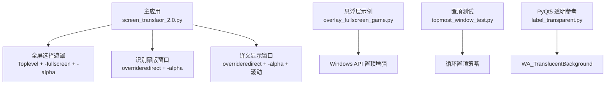
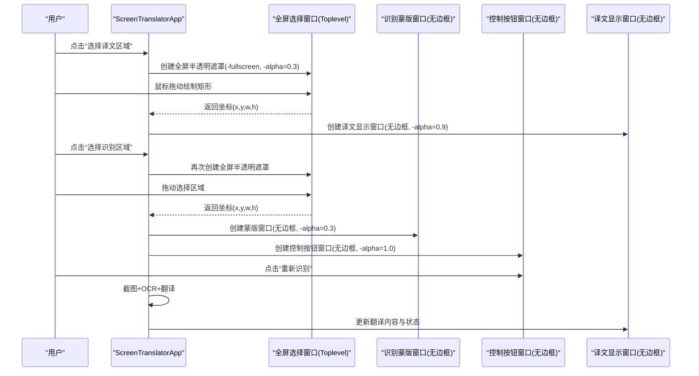
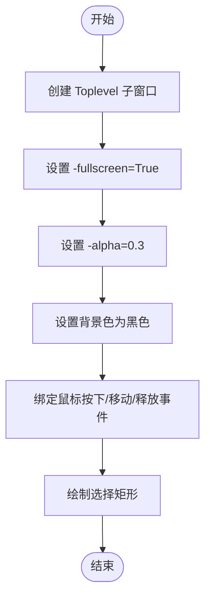
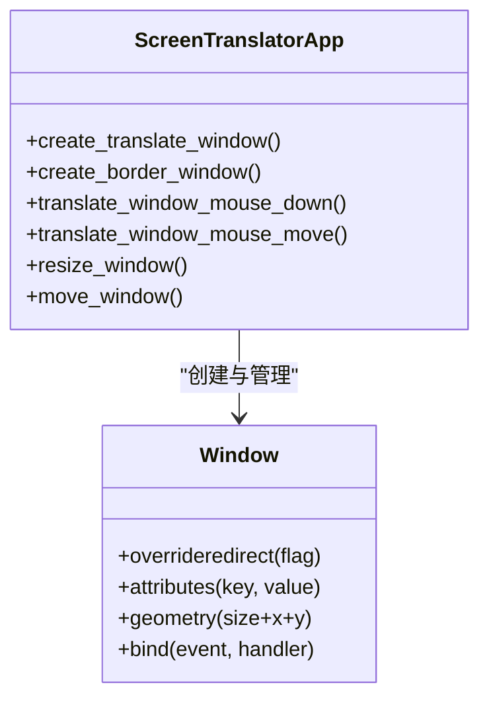
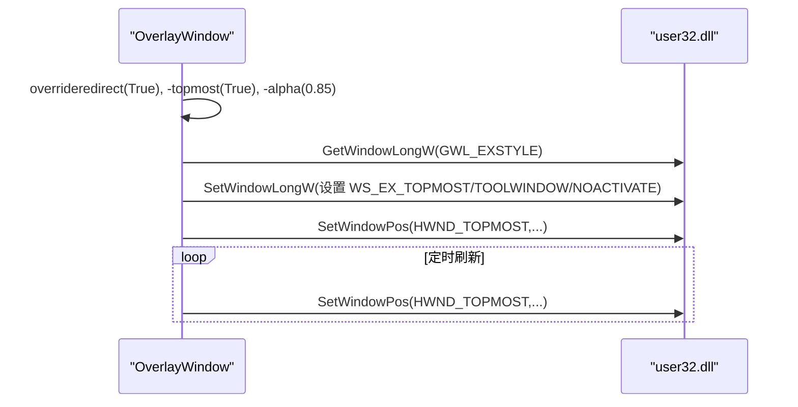
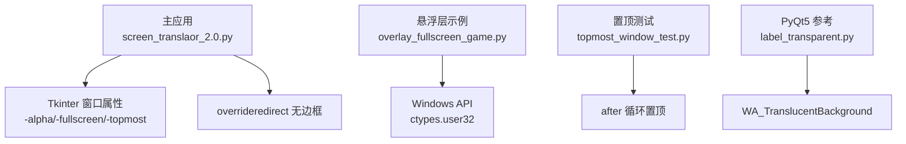

# 透明窗口效果

<cite>
**本文引用的文件**   
- [screen_translaor_2.0.py](file://test/screen_translaor_2.0.py)
- [overlay_fullscreen_game.py](file://test/overlay_fullscreen_game.py)
- [topmost_window_test.py](file://test/topmost_window_test.py)
- [label_transparent.py](file://test/label_transparent.py)
- [screen_translator_with_qwen.py](file://screen_translator_with_qwen.py)
</cite>

## 目录
1. [简介](#简介)
2. [项目结构](#项目结构)
3. [核心组件](#核心组件)
4. [架构总览](#架构总览)
5. [详细组件分析](#详细组件分析)
6. [依赖关系分析](#依赖关系分析)
7. [性能考虑](#性能考虑)
8. [故障排除指南](#故障排除指南)
9. [结论](#结论)
10. [附录](#附录)

## 简介
本技术文档聚焦于基于 Tkinter 的透明窗口效果实现，系统梳理以下主题：
- 使用 wm_attributes('-alpha', value) 控制窗口透明度及其在不同值下的视觉表现
- 全屏选择窗口的半透明背景设置（attributes('-fullscreen', True) 与 attributes('-alpha', 0.3) 组合）
- 无标题栏窗口创建方法 overrideredirect(True) 及其典型应用场景
- 跨平台兼容性考量（Windows、macOS、Linux 在透明度支持上的差异与处理方案）
- 透明度性能优化建议（重绘频率控制、内存使用优化）
- 常见问题排查与最佳实践示例

## 项目结构
仓库中与透明窗口相关的代码主要分布在 test 目录与根目录的主程序文件中。关键文件职责如下：
- test/screen_translaor_2.0.py：屏幕翻译主应用，包含区域选择、无边框可拖拽/缩放窗口、全屏半透明遮罩等完整流程
- screen_translator_with_qwen.py：另一版本主程序，实现了与上述类似的透明窗口逻辑
- test/overlay_fullscreen_game.py：演示悬浮层与置顶策略，结合 Windows API 强化置顶能力
- test/topmost_window_test.py：始终置顶窗口的最小化示例
- test/label_transparent.py：PyQt5 透明窗口参考实现（用于对比不同框架的透明机制）

图表来源
- [screen_translaor_2.0.py:130-208](file://test/screen_translaor_2.0.py#L130-L208)
- [screen_translaor_2.0.py:209-278](file://test/screen_translaor_2.0.py#L209-L278)
- [screen_translaor_2.0.py:357-424](file://test/screen_translaor_2.0.py#L357-L424)
- [overlay_fullscreen_game.py:43-149](file://test/overlay_fullscreen_game.py#L43-L149)
- [topmost_window_test.py:5-83](file://test/topmost_window_test.py#L5-L83)
- [label_transparent.py:5-96](file://test/label_transparent.py#L5-L96)

章节来源
- [screen_translaor_2.0.py:1-1141](file://test/screen_translaor_2.0.py#L1-L1141)
- [overlay_fullscreen_game.py:1-427](file://test/overlay_fullscreen_game.py#L1-L427)
- [topmost_window_test.py:1-89](file://test/topmost_window_test.py#L1-L89)
- [label_transparent.py:1-97](file://test/label_transparent.py#L1-L97)
- [screen_translator_with_qwen.py:490-689](file://screen_translator_with_qwen.py#L490-L689)

## 核心组件
本节从实现角度拆解透明窗口相关的关键点：
- 透明度控制：通过 root.wm_attributes('-alpha', value) 或 window.attributes('-alpha', value) 设置；value 范围通常为 0.0~1.0
- 全屏遮罩：使用 Toplevel 子窗口并设置 attributes('-fullscreen', True) 与较低 alpha 值，形成覆盖式选择界面
- 无标题栏窗口：使用 overrideredirect(True) 移除系统边框，配合自定义拖拽/缩放逻辑
- 置顶策略：attributes('-topmost', True)，必要时结合操作系统 API 强制置顶
- 滚动与内容展示：在无边框窗口内嵌入 Canvas + Frame + Label 的组合，实现长文本滚动显示

章节来源
- [screen_translaor_2.0.py:42-51](file://test/screen_translaor_2.0.py#L42-L51)
- [screen_translaor_2.0.py:130-158](file://test/screen_translaor_2.0.py#L130-L158)
- [screen_translaor_2.0.py:209-278](file://test/screen_translaor_2.0.py#L209-L278)
- [screen_translaor_2.0.py:357-424](file://test/screen_translaor_2.0.py#L357-L424)
- [overlay_fullscreen_game.py:43-149](file://test/overlay_fullscreen_game.py#L43-L149)
- [topmost_window_test.py:74-77](file://test/topmost_window_test.py#L74-L77)

## 架构总览
下图展示了透明窗口在主应用中的交互关系与数据流：用户在全屏遮罩中选择区域后，生成无边框蒙版窗口与按钮窗口，随后触发识别与翻译流程，并在独立的无边框译文窗口中展示结果。

图表来源
- [screen_translaor_2.0.py:130-208](file://test/screen_translaor_2.0.py#L130-L208)
- [screen_translaor_2.0.py:209-278](file://test/screen_translaor_2.0.py#L209-L278)
- [screen_translaor_2.0.py:357-424](file://test/screen_translaor_2.0.py#L357-L424)
- [screen_translaor_2.0.py:425-604](file://test/screen_translaor_2.0.py#L425-L604)

## 详细组件分析

### 透明度控制原理与用法
- 方法：root.wm_attributes('-alpha', value) 或 window.attributes('-alpha', value)
- 取值范围：0.0（完全透明）到 1.0（完全不透明），常用区间为 0.1~1.0
- 视觉效果：
  - 0.9：轻微透明，适合主界面或内容窗口
  - 0.3：较深半透明，适合全屏遮罩或蒙版
  - 1.0：完全不透明，适合按钮或需要高可读性的控件
- 注意事项：
  - 某些平台对 alpha 的支持存在差异，需做兼容处理
  - 频繁改变 alpha 可能引发重绘开销，应适度调整

章节来源
- [screen_translaor_2.0.py:42-51](file://test/screen_translaor_2.0.py#L42-L51)
- [screen_translaor_2.0.py:130-158](file://test/screen_translaor_2.0.py#L130-L158)
- [screen_translaor_2.0.py:209-278](file://test/screen_translaor_2.0.py#L209-L278)
- [screen_translaor_2.0.py:357-424](file://test/screen_translaor_2.0.py#L357-L424)
- [overlay_fullscreen_game.py:43-149](file://test/overlay_fullscreen_game.py#L43-L149)

### 全屏选择窗口的半透明背景
- 实现要点：
  - 使用 Toplevel 创建子窗口
  - attributes('-fullscreen', True) 使窗口覆盖整个屏幕
  - attributes('-alpha', 0.3) 设置半透明背景
  - configure(bg='black') 提供深色遮罩底色
  - 绑定鼠标事件以绘制选择矩形
- 适用场景：
  - 屏幕区域选择（如 OCR 区域、翻译区域）
  - 游戏或全屏应用的辅助悬浮层

图表来源
- [screen_translaor_2.0.py:130-208](file://test/screen_translaor_2.0.py#L130-L208)

章节来源
- [screen_translaor_2.0.py:130-208](file://test/screen_translaor_2.0.py#L130-L208)
- [screen_translator_with_qwen.py:635-689](file://screen_translator_with_qwen.py#L635-L689)

### 无标题栏窗口创建与应用
- 方法：window.overrideredirect(True)
- 效果：移除系统标题栏与边框，便于自定义 UI 与交互
- 常见搭配：
  - attributes('-topmost', True) 置顶显示
  - attributes('-alpha', 0.9) 半透明内容窗口
  - 自定义拖拽与缩放逻辑（监听鼠标事件并更新 geometry）
- 应用场景：
  - 悬浮工具条、字幕窗口、实时信息面板
  - 游戏 HUD、翻译结果浮窗

图表来源
- [screen_translaor_2.0.py:209-278](file://test/screen_translaor_2.0.py#L209-L278)
- [screen_translaor_2.0.py:357-424](file://test/screen_translaor_2.0.py#L357-L424)
- [screen_translaor_2.0.py:971-1106](file://test/screen_translaor_2.0.py#L971-L1106)

章节来源
- [screen_translaor_2.0.py:209-278](file://test/screen_translaor_2.0.py#L209-L278)
- [screen_translaor_2.0.py:357-424](file://test/screen_translaor_2.0.py#L357-L424)
- [screen_translaor_2.0.py:971-1106](file://test/screen_translaor_2.0.py#L971-L1106)

### 置顶策略与 Windows API 增强
- 基础置顶：attributes('-topmost', True)
- 持续置顶：使用 after 循环或后台线程周期性调用 set_window_topmost
- Windows 增强：通过 ctypes 调用 user32.SetWindowPos 与 GetWindowLongW/SetWindowLongW 设置扩展样式（WS_EX_TOPMOST、WS_EX_TOOLWINDOW、WS_EX_NOACTIVATE）
- 适用场景：
  - 全屏游戏悬浮层
  - 需要强置顶且不被激活的辅助窗口

图表来源
- [overlay_fullscreen_game.py:26-41](file://test/overlay_fullscreen_game.py#L26-L41)
- [overlay_fullscreen_game.py:110-133](file://test/overlay_fullscreen_game.py#L110-L133)
- [overlay_fullscreen_game.py:238-266](file://test/overlay_fullscreen_game.py#L238-L266)

章节来源
- [overlay_fullscreen_game.py:43-149](file://test/overlay_fullscreen_game.py#L43-L149)
- [overlay_fullscreen_game.py:152-298](file://test/overlay_fullscreen_game.py#L152-L298)
- [topmost_window_test.py:74-77](file://test/topmost_window_test.py#L74-L77)

### 跨平台兼容性考虑
- Windows：
  - 支持 wm_attributes('-alpha', value)
  - 可使用 ctypes 调用 user32 进行更精细的窗口样式控制
- macOS：
  - 支持 alpha 属性，但行为可能与 Windows 略有差异
  - 建议使用较低的 alpha 值避免渲染异常
- Linux：
  - 取决于桌面环境与 WM 实现，部分环境不支持 alpha 或表现不一致
  - 可降级为纯色半透明背景或使用其他替代方案
- 建议：
  - 检测平台并动态调整透明度策略
  - 在不可用平台上回退为不透明或低开销方案

章节来源
- [overlay_fullscreen_game.py:110-133](file://test/overlay_fullscreen_game.py#L110-L133)
- [label_transparent.py:13-15](file://test/label_transparent.py#L13-15)

### 滚动与内容展示（无边框窗口内）
- 结构：Canvas + Frame + Label
- 关键点：
  - 使用 canvas.configure(scrollregion=canvas.bbox("all")) 更新滚动区域
  - 绑定 MouseWheel 与 Button-4/5 以兼容多平台滚轮事件
  - 窗口尺寸变化时动态更新 wraplength 与 scrollregion
- 优势：
  - 无边框下仍可流畅滚动长文本
  - 适配高分屏与多显示器

章节来源
- [screen_translaor_2.0.py:209-278](file://test/screen_translaor_2.0.py#L209-L278)
- [screen_translaor_2.0.py:1091-1106](file://test/screen_translaor_2.0.py#L1091-L1106)

## 依赖关系分析
透明窗口功能主要依赖 Tkinter 的窗口属性与事件机制，以及可选的 Windows API 增强。各模块之间的耦合度较低，职责清晰：
- 主应用负责窗口生命周期与业务逻辑
- 悬浮层示例独立运行，专注于置顶与透明度
- PyQt5 参考实现用于对比透明机制

图表来源
- [screen_translaor_2.0.py:130-208](file://test/screen_translaor_2.0.py#L130-L208)
- [overlay_fullscreen_game.py:110-133](file://test/overlay_fullscreen_game.py#L110-L133)
- [topmost_window_test.py:74-77](file://test/topmost_window_test.py#L74-L77)
- [label_transparent.py:13-15](file://test/label_transparent.py#L13-15)

章节来源
- [screen_translaor_2.0.py:1-1141](file://test/screen_translaor_2.0.py#L1-L1141)
- [overlay_fullscreen_game.py:1-427](file://test/overlay_fullscreen_game.py#L1-L427)
- [topmost_window_test.py:1-89](file://test/topmost_window_test.py#L1-L89)
- [label_transparent.py:1-97](file://test/label_transparent.py#L1-L97)

## 性能考虑
- 重绘频率控制：
  - 避免在高频事件中频繁修改 alpha 或 geometry
  - 使用节流或合并更新策略，减少不必要的重绘
- 内存使用优化：
  - 及时销毁不再使用的窗口对象，防止内存泄漏
  - 在无边框窗口内避免过大的背景图或复杂控件树
- 置顶线程开销：
  - 后台置顶线程的休眠间隔不宜过小（例如 0.05~0.1s）
  - 仅在需要时启用强制置顶，降低 CPU 占用
- 滚动性能：
  - 合理设置 scrollregion，避免过大区域导致计算开销
  - 在窗口尺寸变化时批量更新而非逐元素更新

[本节为通用指导，无需具体文件引用]

## 故障排除指南
- 透明度无效或不稳定：
  - 检查平台是否支持 alpha；在 Linux 上可能需要更换 WM 或改用其他方案
  - 避免同时设置过多透明层级，可能导致合成器压力过大
- 无边框窗口无法拖拽：
  - 确认已绑定鼠标按下/移动事件并正确更新 geometry
  - 确保未与其他事件冲突
- 置顶失效或被遮挡：
  - 使用 after 循环或后台线程周期性置顶
  - 在 Windows 上使用 user32.SetWindowPos 强制置顶
- 全屏遮罩无法退出：
  - 绑定 ESC 键并正确销毁选择窗口
  - 确保事件绑定在正确的窗口上

章节来源
- [screen_translaor_2.0.py:1127-1136](file://test/screen_translaor_2.0.py#L1127-L1136)
- [overlay_fullscreen_game.py:121-133](file://test/overlay_fullscreen_game.py#L121-L133)
- [topmost_window_test.py:74-77](file://test/topmost_window_test.py#L74-L77)

## 结论
本项目通过 Tkinter 的透明度与无边框能力，构建了完整的屏幕区域选择与悬浮展示体验。结合 Windows API 的置顶增强与跨平台兼容性策略，能够在多种环境下提供一致的透明窗口效果。实践中应关注性能与稳定性，采用合理的重绘与内存管理策略，并通过完善的错误处理提升用户体验。

[本节为总结性内容，无需具体文件引用]

## 附录
- 最佳实践示例路径：
  - 全屏选择遮罩：[screen_translaor_2.0.py:130-208](file://test/screen_translaor_2.0.py#L130-L208)
  - 无边框译文窗口：[screen_translaor_2.0.py:209-278](file://test/screen_translaor_2.0.py#L209-L278)
  - 无边框蒙版与控制按钮：[screen_translaor_2.0.py:357-424](file://test/screen_translaor_2.0.py#L357-L424)
  - Windows 置顶增强：[overlay_fullscreen_game.py:110-133](file://test/overlay_fullscreen_game.py#L110-L133)
  - PyQt5 透明参考：[label_transparent.py:13-15](file://test/label_transparent.py#L13-15)