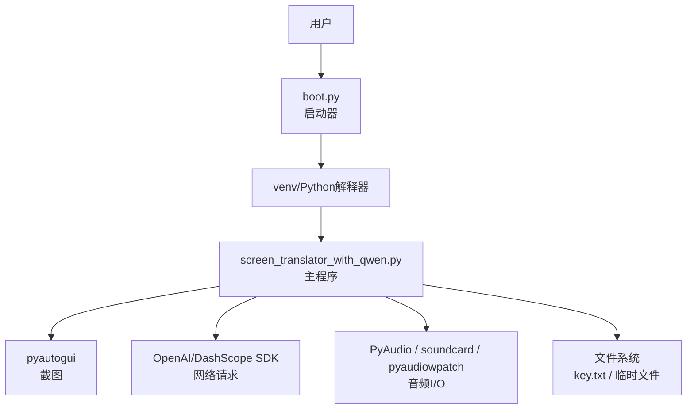
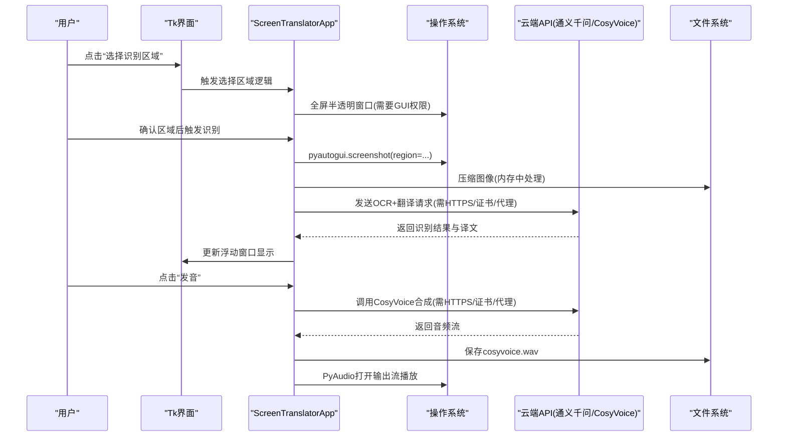
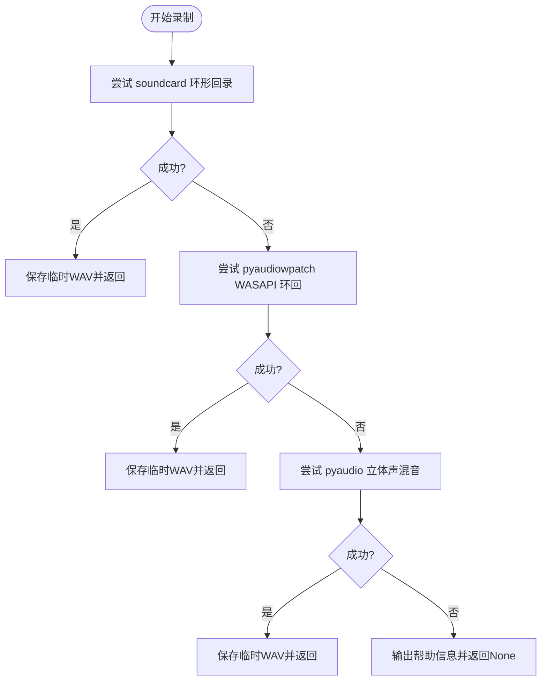
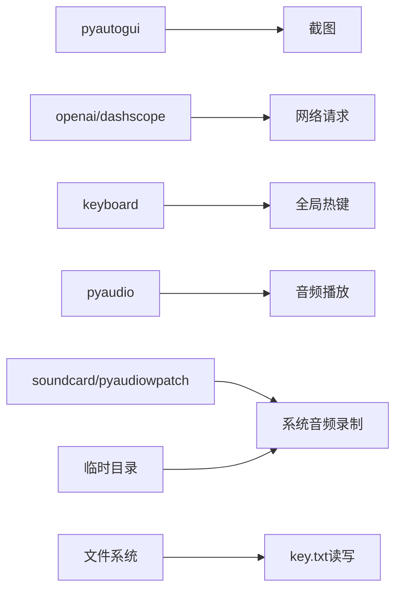

# 系统权限配置

<cite>
**本文引用的文件**   
- [screen_translator_with_qwen.py](file://screen_translator_with_qwen.py)
- [requirements.txt](file://requirements.txt)
- [boot.py](file://boot.py)
- [.gitignore](file://.gitignore)
- [README.md](file://README.md)
</cite>

## 目录
1. [简介](#简介)
2. [项目结构](#项目结构)
3. [核心组件](#核心组件)
4. [架构总览](#架构总览)
5. [详细组件分析](#详细组件分析)
6. [依赖关系分析](#依赖关系分析)
7. [性能与稳定性考量](#性能与稳定性考量)
8. [故障诊断指南](#故障诊断指南)
9. [结论](#结论)
10. [附录：跨平台权限清单](#附录跨平台权限清单)

## 简介
本文件聚焦于“屏幕翻译工具”的系统权限配置，覆盖以下方面：
- 屏幕截图权限（pyautogui）
- 音频录制权限（系统音频、麦克风、不同录音库差异）
- 文件系统访问权限（API密钥文件读写、临时文件、目录权限）
- 网络请求权限（HTTPS证书验证、代理、防火墙）
- 跨平台权限管理（Windows、macOS、Linux）
- 权限问题诊断与解决方案

本项目通过 pyautogui 进行截图，使用 OpenAI/DashScope SDK 调用通义千问与语音合成服务，支持多种系统音频录制方案（soundcard、pyaudiowpatch、pyaudio），并在运行期读取本地 key.txt 作为 API 密钥。

## 项目结构
- 主程序：screen_translator_with_qwen.py
- 启动器：boot.py（自动虚拟环境管理与后台启动）
- 依赖声明：requirements.txt
- 忽略规则：.gitignore（排除 key.txt 等敏感文件）
- 使用说明：README.md（包含 API Key 配置提示）

图表来源
- [boot.py:226-253](file://boot.py#L226-L253)
- [screen_translator_with_qwen.py:339-360](file://screen_translator_with_qwen.py#L339-L360)
- [requirements.txt:1-31](file://requirements.txt#L1-L31)

章节来源
- [README.md:1-154](file://README.md#L1-L154)
- [requirements.txt:1-31](file://requirements.txt#L1-L31)
- [boot.py:1-279](file://boot.py#L1-L279)

## 核心组件
- 截图模块：基于 pyautogui.screenshot(region=...) 截取指定区域
- AI 客户端：OpenAI 兼容接口调用通义千问（OCR+翻译）
- 语音合成：DashScope CosyVoice 流式合成并落盘为 WAV
- 音频播放：PyAudio 打开输出流播放 WAV
- 系统音频录制：多方案回退（soundcard、pyaudiowpatch WASAPI 环回、pyaudio 立体声混音）
- 文件操作：读取 key.txt；写入临时 WAV 到系统临时目录；清理旧文件
- 快捷键：keyboard 全局热键监听

章节来源
- [screen_translator_with_qwen.py:948-952](file://screen_translator_with_qwen.py#L948-L952)
- [screen_translator_with_qwen.py:339-360](file://screen_translator_with_qwen.py#L339-L360)
- [screen_translator_with_qwen.py:1510-1531](file://screen_translator_with_qwen.py#L1510-L1531)
- [screen_translator_with_qwen.py:372-472](file://screen_translator_with_qwen.py#L372-L472)
- [screen_translator_with_qwen.py:1789-1851](file://screen_translator_with_qwen.py#L1789-L1851)
- [screen_translator_with_qwen.py:1753-1778](file://screen_translator_with_qwen.py#L1753-L1778)

## 架构总览
下图展示从用户交互到各子系统权限调用的整体流程。

图表来源
- [screen_translator_with_qwen.py:927-1021](file://screen_translator_with_qwen.py#L927-L1021)
- [screen_translator_with_qwen.py:1123-1248](file://screen_translator_with_qwen.py#L1123-L1248)
- [screen_translator_with_qwen.py:1442-1556](file://screen_translator_with_qwen.py#L1442-L1556)
- [screen_translator_with_qwen.py:372-472](file://screen_translator_with_qwen.py#L372-L472)

## 详细组件分析

### 屏幕截图权限（pyautogui）
- 行为说明：在主线程或子线程中调用 pyautogui.screenshot(region=(x,y,w,h)) 完成区域截图。
- 权限要点：
  - Windows：通常无需管理员权限即可截图；若被安全软件拦截，需在安全软件白名单中添加进程。
  - macOS：可能需要授予“辅助功能”权限给终端/IDE/打包后的应用，以便允许屏幕捕获。
  - Linux：X11/Wayland 下一般可截图；Wayland 下部分桌面环境可能限制截屏，需确保运行在 X11 或使用支持的 Wayland 会话。
- 常见错误与定位：
  - 截图为空或黑屏：检查是否处于全屏独占游戏/某些 DRM 保护场景；尝试以普通用户运行而非管理员。
  - 坐标越界：确认当前显示器分辨率与 DPI 缩放设置。

章节来源
- [screen_translator_with_qwen.py:948-952](file://screen_translator_with_qwen.py#L948-L952)

### 音频录制权限（系统音频、麦克风、不同录音库差异）
- 三种录制方案与适用场景：
  - soundcard：优先使用默认扬声器环形回录；对蓝牙耳机兼容性有限。
  - pyaudiowpatch（WASAPI 环回）：Windows 专用，支持蓝牙耳机，推荐首选。
  - pyaudio（立体声混音）：需系统启用“立体声混音”设备。
- 权限要点：
  - Windows：
    - 使用 WASAPI 环回时，若出现访问拒绝（如错误码 0x80070005），多为设备不支持或驱动限制；建议切换到内置扬声器/有线耳机或安装 pyaudiowpatch。
    - 使用立体声混音时，需在“声音控制面板→录制→显示禁用的设备→启用立体声混音”。
  - macOS/Linux：
    - 系统级音频捕获通常需要额外授权（例如 macOS 的“麦克风”权限用于输入设备；系统音频捕获在某些环境下受限）。
    - 若仅能获取麦克风输入，则无法直接录制系统声音，只能录制外部声音。
- 关键实现路径：
  - 统一入口：record_system_audio()
  - 方案1：_record_with_soundcard_silent()
  - 方案2：_record_with_pyaudiowpatch_silent()
  - 方案3：_record_with_pyaudio_silent()

图表来源
- [screen_translator_with_qwen.py:1789-1851](file://screen_translator_with_qwen.py#L1789-L1851)
- [screen_translator_with_qwen.py:1853-1892](file://screen_translator_with_qwen.py#L1853-L1892)
- [screen_translator_with_qwen.py:1943-1998](file://screen_translator_with_qwen.py#L1943-L1998)
- [screen_translator_with_qwen.py:2070-2145](file://screen_translator_with_qwen.py#L2070-L2145)

章节来源
- [screen_translator_with_qwen.py:1789-1851](file://screen_translator_with_qwen.py#L1789-L1851)
- [screen_translator_with_qwen.py:1853-1892](file://screen_translator_with_qwen.py#L1853-L1892)
- [screen_translator_with_qwen.py:1943-1998](file://screen_translator_with_qwen.py#L1943-L1998)
- [screen_translator_with_qwen.py:2070-2145](file://screen_translator_with_qwen.py#L2070-L2145)

### 文件系统访问权限（API密钥、临时文件、目录权限）
- API 密钥文件 key.txt：
  - 程序启动时读取 key.txt 作为通义千问与 CosyVoice 的 API Key。
  - .gitignore 已排除 key.txt，避免泄露。
- 临时文件：
  - 语音合成生成 cosyvoice.wav 位于程序工作目录，退出时清理。
  - 听歌识曲将音频保存到系统临时目录（tempfile.gettempdir()），识别完成后删除。
- 目录权限：
  - 需要在工作目录具有读写权限（创建/删除 cosyvoice.wav）。
  - 需要向系统临时目录写入临时音频文件。

章节来源
- [screen_translator_with_qwen.py:339-346](file://screen_translator_with_qwen.py#L339-L346)
- [screen_translator_with_qwen.py:363-371](file://screen_translator_with_qwen.py#L363-L371)
- [screen_translator_with_qwen.py:1526-1531](file://screen_translator_with_qwen.py#L1526-L1531)
- [screen_translator_with_qwen.py:1881-1887](file://screen_translator_with_qwen.py#L1881-L1887)
- [screen_translator_with_qwen.py:2312-2318](file://screen_translator_with_qwen.py#L2312-L2318)
- [.gitignore:6-8](file://.gitignore#L6-L8)

### 网络请求权限（HTTPS 证书、代理、防火墙）
- 通义千问与 CosyVoice 均通过 HTTPS 访问阿里云 DashScope 端点。
- 证书验证：
  - 默认遵循系统 CA 证书链；企业内网如需自定义 CA，需配置系统信任或环境变量。
- 代理与网络策略：
  - 若受公司代理/防火墙限制，需配置 HTTP(S)_PROXY 环境变量或通过 SDK 参数设置代理。
- 失败模式：
  - 401 Unauthorized：API Key 无效或过期。
  - 429 Too Many Requests：请求频率过高，指数退避重试。
  - 413 Payload Too Large：图片过大导致请求体超限，应缩小识别区域。

章节来源
- [screen_translator_with_qwen.py:353-360](file://screen_translator_with_qwen.py#L353-L360)
- [screen_translator_with_qwen.py:1148-1248](file://screen_translator_with_qwen.py#L1148-L1248)
- [README.md:45-56](file://README.md#L45-L56)

### 键盘全局热键权限（keyboard）
- 使用 keyboard.add_hotkey 注册全局快捷键，需要进程具备注入钩子的能力。
- Windows：
  - 普通用户通常可以注册全局热键；若被安全软件拦截，请添加白名单。
  - 某些游戏或高权限进程可能屏蔽低权限进程的钩子，必要时以管理员身份运行。
- macOS/Linux：
  - 可能需要授予“辅助功能”或相应输入监控权限。

章节来源
- [screen_translator_with_qwen.py:1753-1778](file://screen_translator_with_qwen.py#L1753-L1778)

## 依赖关系分析
- 截图：pyautogui
- 图像处理：Pillow
- 网络：openai、dashscope
- 音频：pyaudio、soundcard、soundfile、numpy、pyaudiowpatch
- 快捷键：keyboard
- 构建与启动：boot.py 负责虚拟环境校验、依赖增量更新与后台启动

图表来源
- [requirements.txt:1-31](file://requirements.txt#L1-L31)
- [screen_translator_with_qwen.py:339-360](file://screen_translator_with_qwen.py#L339-L360)
- [screen_translator_with_qwen.py:1789-1851](file://screen_translator_with_qwen.py#L1789-L1851)
- [screen_translator_with_qwen.py:1753-1778](file://screen_translator_with_qwen.py#L1753-L1778)

章节来源
- [requirements.txt:1-31](file://requirements.txt#L1-L31)
- [boot.py:209-253](file://boot.py#L209-L253)

## 性能与稳定性考量
- 截图压缩：先增强对比度再灰度化，JPEG 压缩降低传输体积，减少网络延迟与超时风险。
- 网络重试：针对 429 采用指数退避+随机抖动，提升在高并发下的成功率。
- 音频录制：按优先级依次尝试三种方案，最大化在不同硬件组合上的可用性。
- 资源清理：程序退出时清理 cosyvoice.wav，避免磁盘占用。

章节来源
- [screen_translator_with_qwen.py:1098-1121](file://screen_translator_with_qwen.py#L1098-L1121)
- [screen_translator_with_qwen.py:1148-1248](file://screen_translator_with_qwen.py#L1148-L1248)
- [screen_translator_with_qwen.py:363-371](file://screen_translator_with_qwen.py#L363-L371)

## 故障诊断指南
- 无法截图
  - 现象：截图为空/黑屏/报错
  - 排查：关闭全屏独占应用；检查 DPI 缩放；在安全软件中添加白名单；macOS 授予辅助功能权限；Linux 切换至 X11 会话
- 无法录制系统音频
  - 现象：所有方案均失败
  - 排查：
    - Windows：安装 pyaudiowpatch；若 0x80070005，改用内置扬声器/有线耳机；启用“立体声混音”
    - macOS/Linux：确认系统允许系统音频捕获；否则仅能录制麦克风输入
- 无法播放语音
  - 现象：无声音/报错
  - 排查：检查默认输出设备；确认 PyAudio 可用；查看日志中的音频播放异常
- 网络请求失败
  - 现象：401/429/413/连接超时
  - 排查：
    - 401：检查 key.txt 内容是否正确
    - 429：等待并重试
    - 413：缩小识别区域
    - 连接问题：配置代理/防火墙放行；检查系统 CA 证书
- 快捷键无效
  - 现象：F1 不触发
  - 排查：检查 keyboard 是否安装；安全软件是否拦截；必要时以管理员运行

章节来源
- [screen_translator_with_qwen.py:1789-1851](file://screen_translator_with_qwen.py#L1789-L1851)
- [screen_translator_with_qwen.py:1148-1248](file://screen_translator_with_qwen.py#L1148-L1248)
- [screen_translator_with_qwen.py:372-472](file://screen_translator_with_qwen.py#L372-L472)
- [screen_translator_with_qwen.py:1753-1778](file://screen_translator_with_qwen.py#L1753-L1778)

## 结论
本项目的权限涉及屏幕截图、系统音频录制、文件读写与网络通信四大类。通过多方案回退与完善的错误提示，可在多数环境下稳定运行。建议在部署前完成如下准备：
- 正确配置 key.txt 并确保可读
- 根据硬件选择合适音频录制方案（优先 pyaudiowpatch）
- 在网络受限环境中配置代理与证书
- 在 macOS 上授予必要的辅助功能权限

[本节不直接分析具体文件，故无章节来源]

## 附录：跨平台权限清单

- Windows
  - 截图：普通用户即可；若被安全软件拦截，加入白名单
  - 系统音频录制：
    - 推荐安装 pyaudiowpatch 并使用 WASAPI 环回
    - 若使用立体声混音，需在“声音控制面板→录制→启用立体声混音”
  - 全局热键：必要时以管理员运行以避免被高权限进程屏蔽
  - 网络：配置 HTTP(S)_PROXY 或企业 CA 信任

- macOS
  - 截图：在“系统设置→隐私与安全→辅助功能”中授权终端/IDE/应用
  - 系统音频录制：系统层限制较多，通常只能录制麦克风输入
  - 全局热键：在“辅助功能”中授权 keyboard 库相关进程

- Linux
  - 截图：X11 下通常可用；Wayland 下建议使用 X11 会话
  - 系统音频录制：取决于发行版与桌面环境，通常需安装对应后端（如 PulseAudio/PipeWire）
  - 全局热键：可能需要授予输入监控权限

[本节为通用指导，不直接分析具体文件，故无章节来源]