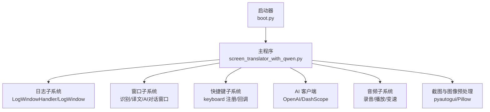
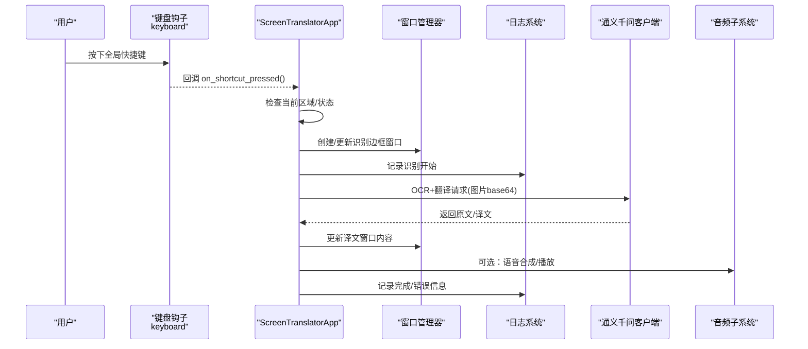
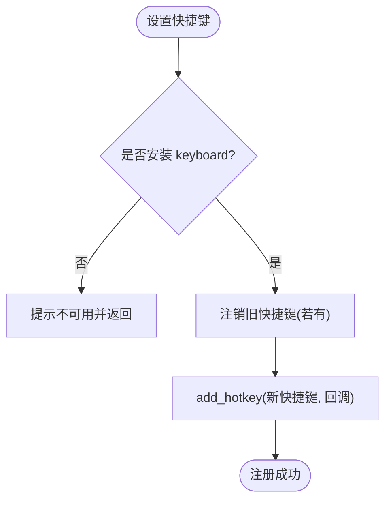
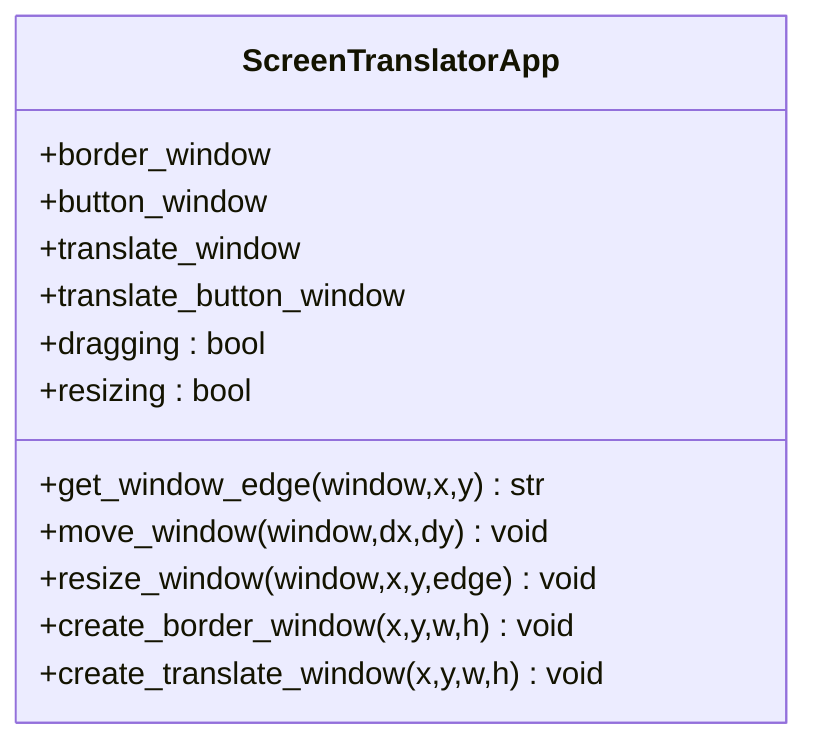
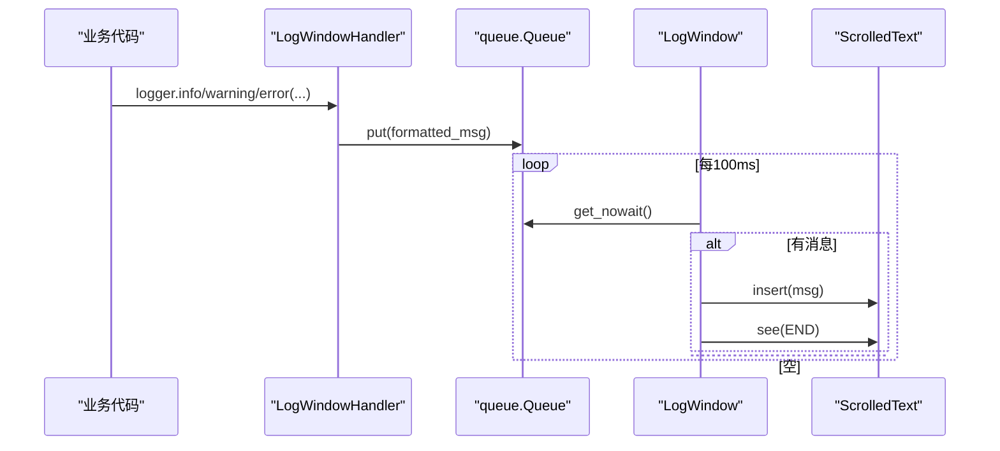
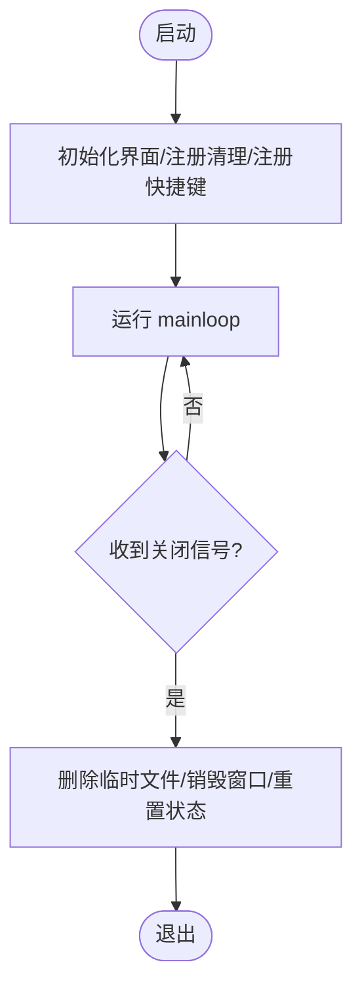
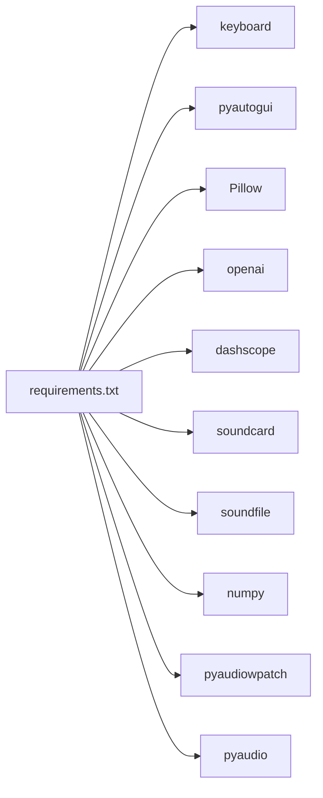

# 系统集成

<cite>
**本文引用的文件**   
- [screen_translator_with_qwen.py](file://screen_translator_with_qwen.py)
- [boot.py](file://boot.py)
- [requirements.txt](file://requirements.txt)
</cite>

## 目录
1. [简介](#简介)
2. [项目结构](#项目结构)
3. [核心组件](#核心组件)
4. [架构总览](#架构总览)
5. [详细组件分析](#详细组件分析)
6. [依赖关系分析](#依赖关系分析)
7. [性能考虑](#性能考虑)
8. [故障排查指南](#故障排查指南)
9. [结论](#结论)
10. [附录](#附录)

## 简介
本文件聚焦于“系统集成”能力，围绕以下主题展开：
- 全局快捷键机制（keyboard 库、事件监听与跨平台注意事项）
- 窗口管理系统（透明/置顶、拖拽与拉伸、多窗口协调与状态管理）
- 日志系统（LogWindow 类、异步队列、级别控制与用户交互）
- 程序生命周期（资源清理、异常处理、优雅退出）
- 系统权限配置（屏幕截图、音频录制、文件系统访问）
- 性能优化建议与最佳实践

## 项目结构
本项目采用单入口应用 + 启动器的组织方式：
- 主程序 screen_translator_with_qwen.py：实现 UI、OCR/翻译、语音合成与播放、听歌识曲、全局快捷键、窗口管理等核心功能。
- 启动器 boot.py：自动检测目标脚本、维护虚拟环境、无控制台后台启动目标程序。
- requirements.txt：声明第三方依赖（键盘监听、图像处理、OpenAI/DashScope SDK、音频采集与播放等）。

图表来源
- [boot.py:256-279](file://boot.py#L256-L279)
- [screen_translator_with_qwen.py:474-634](file://screen_translator_with_qwen.py#L474-L634)

章节来源
- [boot.py:1-279](file://boot.py#L1-L279)
- [screen_translator_with_qwen.py:1-120](file://screen_translator_with_qwen.py#L1-L120)
- [requirements.txt:1-31](file://requirements.txt#L1-L31)

## 核心组件
- 全局快捷键：基于 keyboard 库的 add_hotkey/remove_hotkey，支持运行时动态设置并持久化到实例变量，触发后调用识别流程。
- 窗口管理：无边框置顶窗口、透明度、鼠标拖拽与边缘拉伸、按钮窗口跟随定位、ESC 取消选择、关闭时统一销毁。
- 日志系统：自定义 LogWindowHandler 将日志写入线程安全队列，LogWindow 使用 after 轮询消费队列并追加显示，提供清空/复制操作。
- 生命周期：atexit 与 WM_DELETE_WINDOW 双重清理；识别/翻译/播放状态标志位控制中断；临时文件与音频流释放。
- 权限与设备：截图通过 pyautogui；音频录制优先 soundcard/pyaudiowpatch，回退 pyaudio 立体声混音；WASAPI 环回需 Windows。

章节来源
- [screen_translator_with_qwen.py:1753-1788](file://screen_translator_with_qwen.py#L1753-L1788)
- [screen_translator_with_qwen.py:859-926](file://screen_translator_with_qwen.py#L859-L926)
- [screen_translator_with_qwen.py:21-100](file://screen_translator_with_qwen.py#L21-L100)
- [screen_translator_with_qwen.py:474-500](file://screen_translator_with_qwen.py#L474-L500)
- [screen_translator_with_qwen.py:2407-2416](file://screen_translator_with_qwen.py#L2407-L2416)

## 架构总览
下图展示了关键子系统之间的交互关系与数据流向。

图表来源
- [screen_translator_with_qwen.py:1780-1788](file://screen_translator_with_qwen.py#L1780-L1788)
- [screen_translator_with_qwen.py:927-1021](file://screen_translator_with_qwen.py#L927-L1021)
- [screen_translator_with_qwen.py:1123-1248](file://screen_translator_with_qwen.py#L1123-L1248)
- [screen_translator_with_qwen.py:1442-1556](file://screen_translator_with_qwen.py#L1442-L1556)
- [screen_translator_with_qwen.py:21-100](file://screen_translator_with_qwen.py#L21-L100)

## 详细组件分析

### 全局快捷键子系统
- 注册与注销
  - 使用 keyboard.add_hotkey 注册热键，保存句柄以便后续移除；支持在运行时修改快捷键并重新注册。
  - 未安装 keyboard 库时给出明确提示，避免崩溃。
- 事件处理
  - 快捷键回调中判断是否存在已选识别区域，存在则触发识别流程；不存在则记录日志提示。
- 跨平台注意
  - keyboard 库在 Linux/macOS 通常需要 root/sudo 权限才能注入全局钩子；Windows 下一般无需额外权限。
  - 某些游戏或全屏独占模式可能拦截底层输入，导致快捷键失效。

图表来源
- [screen_translator_with_qwen.py:1734-1768](file://screen_translator_with_qwen.py#L1734-L1768)
- [screen_translator_with_qwen.py:1770-1779](file://screen_translator_with_qwen.py#L1770-L1779)
- [screen_translator_with_qwen.py:1780-1788](file://screen_translator_with_qwen.py#L1780-L1788)

章节来源
- [screen_translator_with_qwen.py:1734-1788](file://screen_translator_with_qwen.py#L1734-L1788)
- [requirements.txt:18-19](file://requirements.txt#L18-L19)

### 窗口管理系统
- 透明与置顶
  - 使用 overrideredirect(True) 去除标题栏，配合 attributes('-topmost', True) 和 '-alpha' 实现置顶与半透明效果。
- 拖拽与拉伸
  - 通过 get_window_edge 判定鼠标位置是否在边缘，决定进入拖动或拉伸模式；move_window/resize_window 计算新几何并更新。
  - 为降低抖动，对 delta 进行灵敏度缩放；最小尺寸限制防止窗口过小。
- 多窗口协调
  - 识别区域边框窗口与控制按钮窗口联动：移动/调整大小时同步更新按钮窗口位置，确保始终可见。
  - 译文窗口与发音按钮窗口同理联动。
- 状态管理
  - 使用布尔标志位区分“正在拖动/拉伸”，并在释放时复位；ESC 可取消选择区域。

图表来源
- [screen_translator_with_qwen.py:859-926](file://screen_translator_with_qwen.py#L859-L926)
- [screen_translator_with_qwen.py:1268-1409](file://screen_translator_with_qwen.py#L1268-L1409)
- [screen_translator_with_qwen.py:1611-1703](file://screen_translator_with_qwen.py#L1611-L1703)

章节来源
- [screen_translator_with_qwen.py:859-926](file://screen_translator_with_qwen.py#L859-L926)
- [screen_translator_with_qwen.py:1268-1409](file://screen_translator_with_qwen.py#L1268-L1409)
- [screen_translator_with_qwen.py:1611-1703](file://screen_translator_with_qwen.py#L1611-L1703)

### 日志记录系统
- 架构
  - LogWindowHandler 继承 logging.Handler，将格式化后的消息放入线程安全的 queue.Queue。
  - LogWindow 使用 Tkinter 的 after 定时轮询队列，非阻塞地追加到 ScrolledText，并提供清空/复制全部功能。
- 级别控制
  - 通过 logging.basicConfig(level=...) 控制输出级别；可按需调整以过滤调试信息。
- 线程安全
  - Handler.emit 仅入队，UI 更新在主线程 via after，避免跨线程直接操作 Tk 控件。

图表来源
- [screen_translator_with_qwen.py:21-33](file://screen_translator_with_qwen.py#L21-L33)
- [screen_translator_with_qwen.py:34-100](file://screen_translator_with_qwen.py#L34-L100)
- [screen_translator_with_qwen.py:302-312](file://screen_translator_with_qwen.py#L302-L312)

章节来源
- [screen_translator_with_qwen.py:21-100](file://screen_translator_with_qwen.py#L21-L100)
- [screen_translator_with_qwen.py:302-312](file://screen_translator_with_qwen.py#L302-L312)

### 程序生命周期管理
- 启动与初始化
  - 主进程创建根窗口，注册 atexit 清理函数，绑定 WM_DELETE_WINDOW 用于优雅退出。
- 资源清理
  - 关闭时删除临时语音文件；销毁所有辅助窗口；重置状态标志。
- 异常处理
  - 识别/翻译/播放均包裹 try/except，并通过 root.after 将错误信息安全更新到 UI。
- 优雅退出
  - 捕获窗口关闭事件，执行清理后再销毁主循环。

图表来源
- [screen_translator_with_qwen.py:474-500](file://screen_translator_with_qwen.py#L474-L500)
- [screen_translator_with_qwen.py:2407-2416](file://screen_translator_with_qwen.py#L2407-L2416)
- [screen_translator_with_qwen.py:1410-1441](file://screen_translator_with_qwen.py#L1410-L1441)

章节来源
- [screen_translator_with_qwen.py:474-500](file://screen_translator_with_qwen.py#L474-L500)
- [screen_translator_with_qwen.py:1410-1441](file://screen_translator_with_qwen.py#L1410-L1441)
- [screen_translator_with_qwen.py:2407-2416](file://screen_translator_with_qwen.py#L2407-L2416)

### 系统权限配置指导
- 屏幕截图
  - 使用 pyautogui.screenshot(region=...) 截取指定区域。通常无需额外权限；若被安全软件拦截，请将其加入白名单。
- 音频录制
  - 首选方案：soundcard 环形回录或 pyaudiowpatch WASAPI 环回（Windows），支持蓝牙耳机场景。
  - 备选方案：pyaudio 立体声混音，需在系统声音控制面板启用“立体声混音”。
  - 常见错误码与提示：如 0x80070005（访问拒绝）、0x8889000A（格式不支持）等，已在代码中给出诊断与建议。
- 文件系统访问
  - 读写 key.txt、cosyvoice.wav 及临时音频文件；确保运行账户具备相应目录写权限。
- 网络与 API
  - OpenAI/DashScope 客户端需要有效 API Key；401/429 等错误会给出明确提示与重试策略。

章节来源
- [screen_translator_with_qwen.py:1789-1851](file://screen_translator_with_qwen.py#L1789-L1851)
- [screen_translator_with_qwen.py:1853-1941](file://screen_translator_with_qwen.py#L1853-L1941)
- [screen_translator_with_qwen.py:1943-1998](file://screen_translator_with_qwen.py#L1943-L1998)
- [screen_translator_with_qwen.py:2070-2145](file://screen_translator_with_qwen.py#L2070-L2145)
- [screen_translator_with_qwen.py:338-360](file://screen_translator_with_qwen.py#L338-L360)

## 依赖关系分析
- 外部库职责
  - keyboard：全局快捷键注入与监听。
  - pyautogui：屏幕截图。
  - Pillow：图像增强与压缩。
  - openai/dashscope：AI 对话与语音合成。
  - soundcard/soundfile/numpy：系统音频环形回录。
  - pyaudiowpatch：WASAPI 环回（Windows，支持蓝牙耳机）。
  - pyaudio：立体声混音回退路径。
- 版本约束
  - requirements.txt 中给出了最低版本要求，保障兼容性。

图表来源
- [requirements.txt:1-31](file://requirements.txt#L1-L31)

章节来源
- [requirements.txt:1-31](file://requirements.txt#L1-L31)

## 性能考虑
- 图像预处理
  - 先提升对比度再灰度化，减少 OCR 噪声；JPEG 压缩质量可调，平衡体积与识别率。
- 网络请求
  - 带指数退避与随机抖动的重试策略，缓解 429 限流；对 401/413 等错误快速失败并提示。
- UI 响应
  - 耗时任务（识别、翻译、语音合成/播放）均在独立线程执行，UI 更新通过 after 调度，避免卡顿。
- 音频播放
  - 支持变速播放（线性插值重采样），按需切换速度模式；播放完成后恢复状态标签。
- 内存与 I/O
  - 音频分块读取/写入，避免一次性加载过大文件；临时文件及时清理。

[本节为通用性能建议，不直接分析具体文件]

## 故障排查指南
- 全局快捷键无效
  - 确认已安装 keyboard 库；Linux/macOS 可能需要管理员权限；部分全屏游戏会屏蔽底层输入。
- 无法录制系统音频
  - 优先安装 pyaudiowpatch；若仍失败，尝试内置扬声器/有线耳机；或在系统声音设置中启用“立体声混音”。
- 语音合成失败
  - 检查 key.txt 中的 API Key 是否有效；关注 401/429 错误提示；必要时等待限流冷却。
- 窗口拖拽/拉伸不灵敏
  - 代码已对位移进行灵敏度缩放；若仍不流畅，可降低分辨率或关闭其他高负载应用。
- 日志窗口无输出
  - 确认日志级别设置正确；检查 LogWindow 是否已 show；观察队列是否持续轮询。

章节来源
- [screen_translator_with_qwen.py:1753-1788](file://screen_translator_with_qwen.py#L1753-L1788)
- [screen_translator_with_qwen.py:1789-1851](file://screen_translator_with_qwen.py#L1789-L1851)
- [screen_translator_with_qwen.py:1123-1248](file://screen_translator_with_qwen.py#L1123-L1248)
- [screen_translator_with_qwen.py:21-100](file://screen_translator_with_qwen.py#L21-L100)

## 结论
本项目在系统集成方面实现了较为完善的快捷键、窗口管理、日志与生命周期管理能力，并结合 AI 与音频能力提供了端到端的屏幕翻译体验。通过合理的线程模型、错误处理与重试策略，系统在可用性、鲁棒性与用户体验上达到了良好平衡。针对权限与平台差异，代码提供了多种回退路径与清晰的诊断信息，便于部署与维护。

[本节为总结性内容，不直接分析具体文件]

## 附录
- 启动器说明
  - boot.py 会自动检测同目录下唯一 .py 作为目标程序，校验并维护 venv，最后以无控制台方式后台启动目标程序。
- 关键路径参考
  - 全局快捷键注册与回调：[screen_translator_with_qwen.py:1734-1788](file://screen_translator_with_qwen.py#L1734-L1788)
  - 识别窗口创建与联动：[screen_translator_with_qwen.py:859-926](file://screen_translator_with_qwen.py#L859-L926)
  - 拖拽/拉伸逻辑：[screen_translator_with_qwen.py:1268-1409](file://screen_translator_with_qwen.py#L1268-L1409)
  - 日志队列与 UI 轮询：[screen_translator_with_qwen.py:21-100](file://screen_translator_with_qwen.py#L21-L100)
  - 生命周期与清理：[screen_translator_with_qwen.py:474-500](file://screen_translator_with_qwen.py#L474-L500), [screen_translator_with_qwen.py:2407-2416](file://screen_translator_with_qwen.py#L2407-L2416)
  - 音频录制多方案：[screen_translator_with_qwen.py:1789-1851](file://screen_translator_with_qwen.py#L1789-L1851)

章节来源
- [boot.py:256-279](file://boot.py#L256-L279)
- [screen_translator_with_qwen.py:1734-1788](file://screen_translator_with_qwen.py#L1734-L1788)
- [screen_translator_with_qwen.py:859-926](file://screen_translator_with_qwen.py#L859-L926)
- [screen_translator_with_qwen.py:1268-1409](file://screen_translator_with_qwen.py#L1268-L1409)
- [screen_translator_with_qwen.py:21-100](file://screen_translator_with_qwen.py#L21-L100)
- [screen_translator_with_qwen.py:474-500](file://screen_translator_with_qwen.py#L474-L500)
- [screen_translator_with_qwen.py:2407-2416](file://screen_translator_with_qwen.py#L2407-L2416)
- [screen_translator_with_qwen.py:1789-1851](file://screen_translator_with_qwen.py#L1789-L1851)