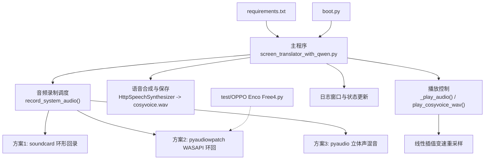
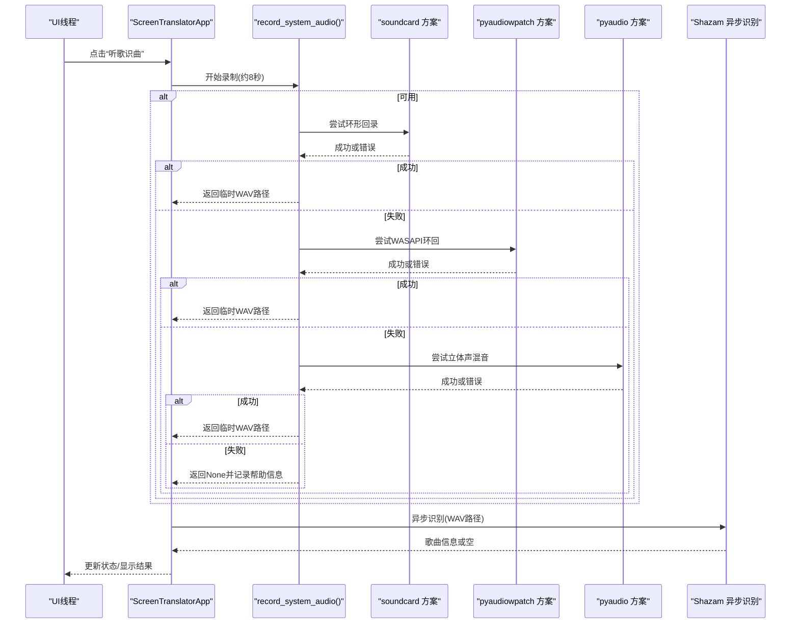
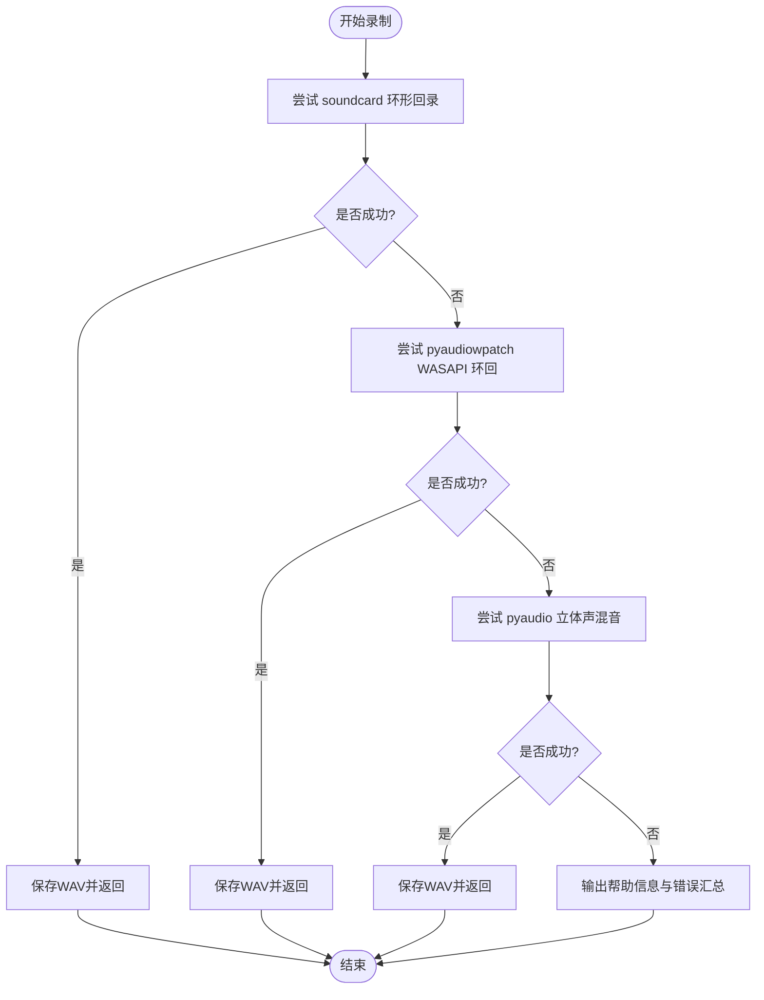
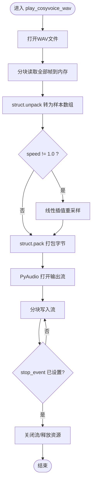
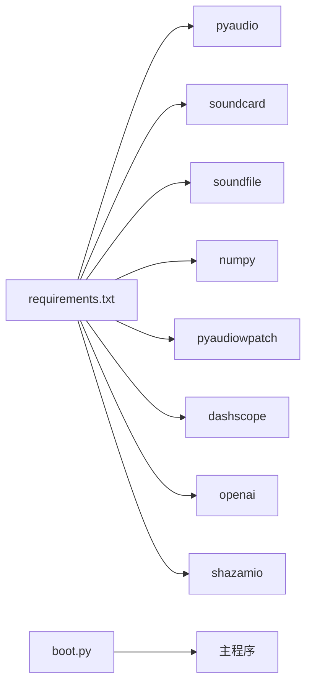

# 音频处理

<cite>
**本文引用的文件**   
- [screen_translator_with_qwen.py](file://screen_translator_with_qwen.py)
- [requirements.txt](file://requirements.txt)
- [boot.py](file://boot.py)
- [OPPO Enco Free4.py](file://test/OPPO Enco Free4.py)
- [shazam_test.py](file://test/shazam_test.py)
</cite>

## 目录
1. [简介](#简介)
2. [项目结构](#项目结构)
3. [核心组件](#核心组件)
4. [架构总览](#架构总览)
5. [详细组件分析](#详细组件分析)
6. [依赖关系分析](#依赖关系分析)
7. [性能与内存优化](#性能与内存优化)
8. [故障排查指南](#故障排查指南)
9. [结论](#结论)
10. [附录：调试与示例](#附录调试与示例)

## 简介
本模块聚焦于系统级音频录制、播放控制、格式转换与设备自动检测。代码实现了三种系统音频录制方案（soundcard、pyaudiowpatch、pyaudio），并提供了基于线性插值的变速播放算法、WAV 读写与字节样本处理、以及默认设备获取与兼容性提示。整体设计以“多方案回退 + 静默错误收集”为核心，确保在不同硬件和驱动环境下具备较好的可用性。

## 项目结构
- 主程序位于根目录，包含完整的 UI、语音合成、音频录制与播放逻辑。
- requirements.txt 声明了所有第三方依赖，包括 pyaudio、soundcard、soundfile、numpy、pyaudiowpatch 等。
- boot.py 为通用启动器，负责虚拟环境校验与目标程序后台启动。
- test 目录提供最小化示例脚本，便于验证 WASAPI 环回录音能力。

图表来源
- [screen_translator_with_qwen.py:1788-1851](file://screen_translator_with_qwen.py#L1788-L1851)
- [screen_translator_with_qwen.py:1853-1941](file://screen_translator_with_qwen.py#L1853-L1941)
- [screen_translator_with_qwen.py:1943-2068](file://screen_translator_with_qwen.py#L1943-L2068)
- [screen_translator_with_qwen.py:2070-2231](file://screen_translator_with_qwen.py#L2070-L2231)
- [screen_translator_with_qwen.py:371-472](file://screen_translator_with_qwen.py#L371-L472)
- [requirements.txt:1-31](file://requirements.txt#L1-L31)
- [boot.py:256-279](file://boot.py#L256-L279)
- [OPPO Enco Free4.py:1-47](file://test/OPPO Enco Free4.py#L1-L47)

章节来源
- [screen_translator_with_qwen.py:1788-1851](file://screen_translator_with_qwen.py#L1788-L1851)
- [requirements.txt:1-31](file://requirements.txt#L1-L31)
- [boot.py:256-279](file://boot.py#L256-L279)

## 核心组件
- 音频录制调度器：统一入口 record_system_audio(duration, sample_rate)，按优先级尝试三种方案，失败时收集错误信息并给出用户可操作的修复建议。
- 录制实现：
  - soundcard 方案：通过默认扬声器名称构造环形回录麦克风，使用 soundfile 写入 PCM_16 WAV。
  - pyaudiowpatch 方案：使用 get_default_wasapi_loopback 动态获取采样率与声道数，直接写 WAV。
  - pyaudio 方案：枚举输入设备，匹配“立体声混音/Stereo Mix”，打开流读取帧后写 WAV。
- 播放控制：
  - _play_audio(stop_event, speed) 调用 play_cosyvoice_wav(stop_event, speed)。
  - play_cosyvoice_wav 支持变速播放，内部实现线性插值重采样，分块写入 PyAudio 输出流。
- 数据与格式：
  - WAV 读写：wave.open 用于读写；struct.pack/unpack 用于样本数组与字节间转换。
  - numpy 参与 soundcard 方案的数值裁剪与类型转换。
- 设备检测与选择策略：
  - soundcard：sc.default_speaker() 获取默认扬声器，再构造 include_loopback=True 的麦克风。
  - pyaudiowpatch：get_default_wasapi_loopback 返回设备元信息（name、defaultSampleRate、maxInputChannels、index）。
  - pyaudio：遍历 p.get_device_count()，筛选 maxInputChannels > 0 且名称含“立体声混音/Stereo Mix”。

章节来源
- [screen_translator_with_qwen.py:1788-1851](file://screen_translator_with_qwen.py#L1788-L1851)
- [screen_translator_with_qwen.py:1853-1941](file://screen_translator_with_qwen.py#L1853-L1941)
- [screen_translator_with_qwen.py:1943-2068](file://screen_translator_with_qwen.py#L1943-L2068)
- [screen_translator_with_qwen.py:2070-2231](file://screen_translator_with_qwen.py#L2070-L2231)
- [screen_translator_with_qwen.py:371-472](file://screen_translator_with_qwen.py#L371-L472)

## 架构总览
下图展示了从“听歌识曲触发”到“系统音频录制”再到“识别结果展示”的完整流程，以及播放控制的并行路径。

图表来源
- [screen_translator_with_qwen.py:1788-1851](file://screen_translator_with_qwen.py#L1788-L1851)
- [screen_translator_with_qwen.py:1853-1941](file://screen_translator_with_qwen.py#L1853-L1941)
- [screen_translator_with_qwen.py:1943-2068](file://screen_translator_with_qwen.py#L1943-L2068)
- [screen_translator_with_qwen.py:2070-2231](file://screen_translator_with_qwen.py#L2070-L2231)
- [screen_translator_with_qwen.py:2232-2270](file://screen_translator_with_qwen.py#L2232-L2270)

## 详细组件分析

### 录制方案对比与适用场景
- soundcard 方案
  - 特点：跨平台抽象层，通过默认扬声器构造环形回录麦克风；对蓝牙耳机兼容性较差。
  - 适用：有线耳机/内置扬声器、Windows 下较稳定的系统音频捕获。
  - 配置要点：需安装 soundcard/soundfile/numpy；默认采样率由 recorder 参数指定。
- pyaudiowpatch 方案
  - 特点：基于 Windows WASAPI 环回，动态获取 defaultSampleRate 与 maxInputChannels，支持蓝牙耳机。
  - 适用：Windows 平台，尤其是蓝牙耳机场景。
  - 配置要点：需安装 pyaudiowpatch；使用 get_default_wasapi_loopback 获取设备索引。
- pyaudio 方案
  - 特点：枚举输入设备，匹配“立体声混音/Stereo Mix”，需要系统启用该设备。
  - 适用：未安装上述库或作为兜底方案；要求系统开启立体声混音。
  - 配置要点：需在系统声音设置中启用“立体声混音”。

图表来源
- [screen_translator_with_qwen.py:1788-1851](file://screen_translator_with_qwen.py#L1788-L1851)
- [screen_translator_with_qwen.py:1853-1941](file://screen_translator_with_qwen.py#L1853-L1941)
- [screen_translator_with_qwen.py:1943-2068](file://screen_translator_with_qwen.py#L1943-L2068)
- [screen_translator_with_qwen.py:2070-2231](file://screen_translator_with_qwen.py#L2070-L2231)

章节来源
- [screen_translator_with_qwen.py:1788-1851](file://screen_translator_with_qwen.py#L1788-L1851)
- [screen_translator_with_qwen.py:1853-1941](file://screen_translator_with_qwen.py#L1853-L1941)
- [screen_translator_with_qwen.py:1943-2068](file://screen_translator_with_qwen.py#L1943-L2068)
- [screen_translator_with_qwen.py:2070-2231](file://screen_translator_with_qwen.py#L2070-L2231)

### 播放控制与变速算法
- 播放入口
  - _play_audio(stop_event, speed) 负责在播放完成后恢复 UI 状态。
  - play_cosyvoice_wav(stop_event, speed) 执行具体播放逻辑。
- 变速重采样（线性插值）
  - 将 WAV 字节解码为样本数组，根据速度因子计算新样本位置，采用相邻样本线性插值生成新序列，再将样本打包回字节。
  - 边界保护：当 floor_pos 越界时回退至倒数第二个样本，保证安全访问。
  - 范围限制：16bit 样本限制在 [-32768, 32767]，8bit 样本限制在 [0, 255]。
- 流式输出
  - 使用 PyAudio 打开输出流，按固定 chunk 大小循环 write，支持 stop_event 中断。

图表来源
- [screen_translator_with_qwen.py:371-472](file://screen_translator_with_qwen.py#L371-L472)

章节来源
- [screen_translator_with_qwen.py:371-472](file://screen_translator_with_qwen.py#L371-L472)
- [screen_translator_with_qwen.py:1557-1568](file://screen_translator_with_qwen.py#L1557-L1568)

### 音频格式转换与数据处理
- WAV 读写
  - wave.open 用于打开/创建 WAV 文件，设置 nchannels、sampwidth、framerate，writeframes 写入原始 PCM 字节。
- 字节与样本互转
  - struct.pack/unpack 根据样本宽度（16bit/8bit）与声道数构建格式串，批量转换。
- 数值处理
  - numpy.clip 对 float 型数据进行幅度裁剪并转换为 int16，避免溢出。

章节来源
- [screen_translator_with_qwen.py:1853-1941](file://screen_translator_with_qwen.py#L1853-L1941)
- [screen_translator_with_qwen.py:1943-2068](file://screen_translator_with_qwen.py#L1943-L2068)
- [screen_translator_with_qwen.py:2070-2231](file://screen_translator_with_qwen.py#L2070-L2231)
- [screen_translator_with_qwen.py:371-472](file://screen_translator_with_qwen.py#L371-L472)

### 设备自动检测与选择策略
- 默认设备获取
  - soundcard：sc.default_speaker() 获取默认扬声器，再以 include_loopback=True 构造环形回录麦克风。
  - pyaudiowpatch：p.get_default_wasapi_loopback() 返回 name、defaultSampleRate、maxInputChannels、index。
  - pyaudio：遍历 p.get_device_count()，筛选名称包含“立体声混音/Stereo Mix”的设备。
- 兼容性处理
  - 检测到蓝牙耳机时给出提示，优先回退到其他方案。
  - 若均未找到合适设备，输出详细的系统设置指引（如启用立体声混音）。

章节来源
- [screen_translator_with_qwen.py:1853-1941](file://screen_translator_with_qwen.py#L1853-L1941)
- [screen_translator_with_qwen.py:1943-2068](file://screen_translator_with_qwen.py#L1943-L2068)
- [screen_translator_with_qwen.py:2070-2231](file://screen_translator_with_qwen.py#L2070-L2231)

## 依赖关系分析
- 运行时依赖
  - pyaudio：音频流 I/O（录制/播放）。
  - soundcard/soundfile/numpy：soundcard 方案的数据采集与写入。
  - pyaudiowpatch：Windows WASAPI 环回增强。
  - dashscope/openai：语音合成与客户端初始化。
  - shazamio：歌曲识别。
- 启动器
  - boot.py 负责虚拟环境校验、依赖增量更新与目标程序后台启动。

图表来源
- [requirements.txt:1-31](file://requirements.txt#L1-L31)
- [boot.py:256-279](file://boot.py#L256-L279)

章节来源
- [requirements.txt:1-31](file://requirements.txt#L1-L31)
- [boot.py:256-279](file://boot.py#L256-L279)

## 性能与内存优化
- 内存管理
  - 当前实现将 WAV 全部读入内存后再进行变速处理，适合短时语音片段；对于长音频应改为流式处理以降低峰值内存占用。
- 流式处理
  - 录制端已按 CHUNK 累积帧，但写入前仍拼接为单一大字节串；可在写入阶段边读边写，减少中间缓冲。
- 错误恢复
  - 多方案回退机制有效提升了鲁棒性；建议在异常分支增加重试与降级策略（例如降低采样率或切换单声道）。
- CPU 开销
  - 线性插值在 Python 层逐样本循环，CPU 密集；可考虑使用 numpy 向量化或 C/C++ 扩展提升性能。

[本节为通用指导，不直接分析具体文件]

## 故障排查指南
- 无法录制系统音频
  - 检查是否安装了 pyaudiowpatch（推荐，支持蓝牙耳机）。
  - 确认默认扬声器是否为蓝牙耳机；若是，切换到内置扬声器或有线耳机。
  - 在 Windows 声音设置中启用“立体声混音”。
- 常见错误码提示
  - 0x80070005：环形回录访问被拒绝（多为蓝牙耳机不支持）。
  - 0x8889000A：音频格式不支持（尝试更换采样率或声道数）。
- 播放无声或卡顿
  - 检查 PyAudio 输出设备是否正确；确认系统音量与静音状态。
  - 若使用变速播放，确认插值边界保护与范围限制生效。

章节来源
- [screen_translator_with_qwen.py:1828-1851](file://screen_translator_with_qwen.py#L1828-L1851)
- [screen_translator_with_qwen.py:1932-1941](file://screen_translator_with_qwen.py#L1932-L1941)

## 结论
本项目实现了稳健的多方案系统音频录制与播放控制，结合线性插值变速与完善的错误提示，能够在多种硬件与驱动组合下稳定工作。未来可在流式处理、向量化重采样与更细粒度的设备选择上进一步优化，以提升性能与用户体验。

[本节为总结，不直接分析具体文件]

## 附录：调试与示例
- 快速验证 WASAPI 环回录音
  - 参考示例脚本，动态获取默认 WASAPI 环回设备的采样率与声道数，录制并保存 WAV。
- Shazam 识别最小用例
  - 使用异步接口识别本地音频文件，打印歌曲名、艺术家与链接等信息。

章节来源
- [OPPO Enco Free4.py:1-47](file://test/OPPO Enco Free4.py#L1-L47)
- [shazam_test.py:1-66](file://test/shazam_test.py#L1-L66)