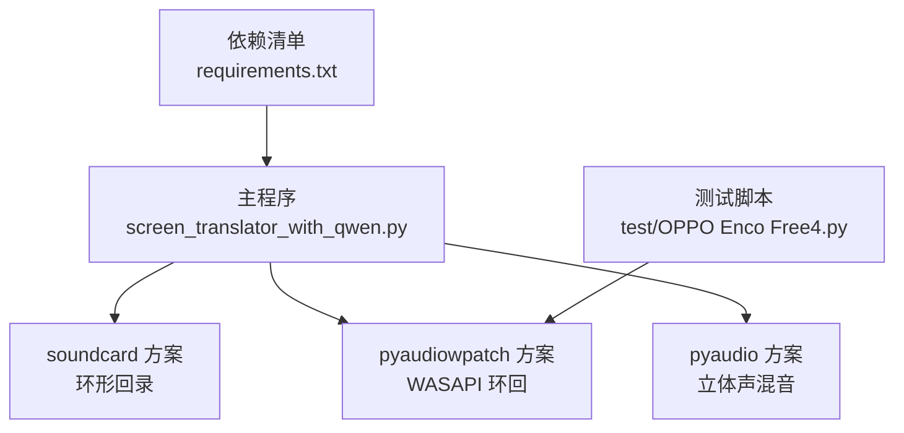
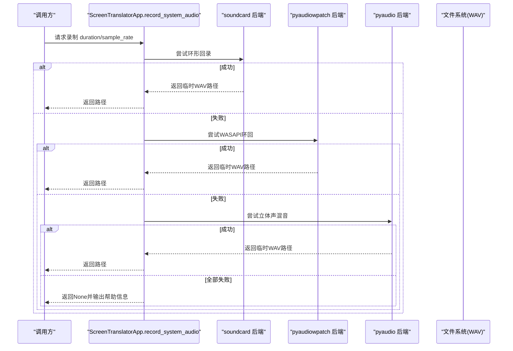
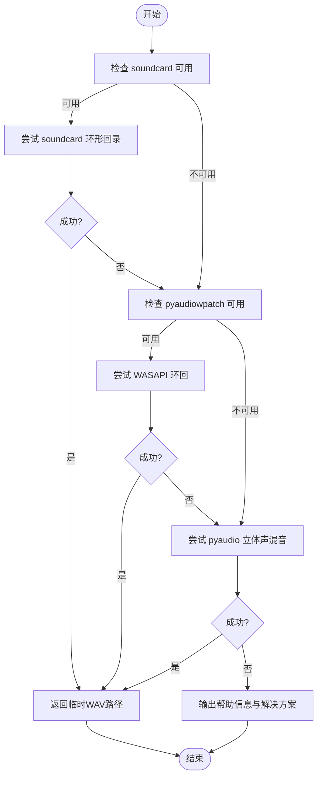

# 音频录制方案

<cite>
**本文引用的文件**   
- [screen_translator_with_qwen.py](file://screen_translator_with_qwen.py)
- [requirements.txt](file://requirements.txt)
- [OPPO Enco Free4.py](file://test/OPPO Enco Free4.py)
</cite>

## 目录
1. [简介](#简介)
2. [项目结构](#项目结构)
3. [核心组件](#核心组件)
4. [架构总览](#架构总览)
5. [详细组件分析](#详细组件分析)
6. [依赖与兼容性](#依赖与兼容性)
7. [性能与资源特性](#性能与资源特性)
8. [故障排查指南](#故障排查指南)
9. [结论与建议](#结论与建议)
10. [附录：关键流程时序图](#附录关键流程时序图)

## 简介
本文件面向本项目中的“系统音频录制”能力，系统性梳理并对比三种实现方案：soundcard、pyaudiowpatch（WASAPI 环回）、pyaudio（立体声混音）。文档涵盖各方案的依赖安装、设备检测机制、音频流获取方式、数据格式转换、错误处理策略、性能特征、跨平台兼容性与权限要求，并提供选择建议与可操作的排障步骤。

## 项目结构
与音频录制相关的代码集中在主程序文件中，并通过可选依赖进行功能开关；测试脚本提供了 pyaudiowpatch 的独立示例。

图表来源
- [screen_translator_with_qwen.py:1789-1851](file://screen_translator_with_qwen.py#L1789-L1851)
- [requirements.txt:1-31](file://requirements.txt#L1-L31)
- [OPPO Enco Free4.py:1-47](file://test/OPPO Enco Free4.py#L1-L47)

章节来源
- [screen_translator_with_qwen.py:1789-2100](file://screen_translator_with_qwen.py#L1789-L2100)
- [requirements.txt:1-31](file://requirements.txt#L1-L31)
- [OPPO Enco Free4.py:1-47](file://test/OPPO Enco Free4.py#L1-L47)

## 核心组件
- 统一入口方法：record_system_audio(duration, sample_rate)，按优先级依次尝试 soundcard、pyaudiowpatch、pyaudio 三种方案，任一成功即返回临时 WAV 文件路径；全部失败则输出详细的帮助信息。
- 三个具体实现：
  - _record_with_soundcard_silent / _record_with_soundcard：基于 soundcard 的环形回录。
  - _record_with_pyaudiowpatch_silent / _record_with_pyaudiowpatch：基于 pyaudiowpatch 的 WASAPI 环回。
  - _record_with_pyaudio_silent：基于 pyaudio 枚举并打开“立体声混音”。
- 可选依赖探测：在模块加载时通过 try/except 动态导入，设置 SOUNDCARD_AVAILABLE、PYAUDPATCH_AVAILABLE 等标志位控制可用方案。

章节来源
- [screen_translator_with_qwen.py:314-336](file://screen_translator_with_qwen.py#L314-L336)
- [screen_translator_with_qwen.py:1789-1851](file://screen_translator_with_qwen.py#L1789-L1851)
- [screen_translator_with_qwen.py:1853-1941](file://screen_translator_with_qwen.py#L1853-L1941)
- [screen_translator_with_qwen.py:1943-2068](file://screen_translator_with_qwen.py#L1943-L2068)
- [screen_translator_with_qwen.py:2070-2100](file://screen_translator_with_qwen.py#L2070-L2100)

## 架构总览
整体采用“多后端重试 + 统一输出”的架构：上层调用 record_system_audio，内部顺序尝试不同后端，最终将 PCM 数据写入临时 WAV 文件供后续识别使用。

图表来源
- [screen_translator_with_qwen.py:1789-1851](file://screen_translator_with_qwen.py#L1789-L1851)
- [screen_translator_with_qwen.py:1853-2100](file://screen_translator_with_qwen.py#L1853-L2100)

## 详细组件分析

### 方案一：soundcard（环形回录）
- 适用场景
  - Windows 下优先尝试，若默认扬声器支持环形回录且非蓝牙设备，成功率较高。
- 依赖库
  - soundcard、soundfile、numpy（见 requirements.txt）。
- 设备检测机制
  - 通过默认扬声器名称定位环形回录麦克风，若检测到蓝牙设备会提示可能不支持。
- 音频流获取与格式
  - 以指定采样率与双声道创建 recorder，一次性读取固定帧数，得到浮点数组后转换为 int16，再使用 soundfile 写出为 WAV。
- 性能特点
  - 一次性 block 录制，内存占用与时长成正比；适合短时片段（如 8 秒）。
- 错误处理
  - 捕获异常并记录日志；对特定错误码给出可读提示（如访问拒绝、格式不支持）。
- 配置要点
  - 确保系统未独占该设备；避免蓝牙耳机作为默认输出。

章节来源
- [screen_translator_with_qwen.py:1853-1941](file://screen_translator_with_qwen.py#L1853-L1941)
- [requirements.txt:25-28](file://requirements.txt#L25-L28)

### 方案二：pyaudiowpatch（WASAPI 环回，推荐）
- 适用场景
  - Windows 环境，尤其当蓝牙耳机或某些驱动不支持 soundcard 环形回录时，WASAPI 环回更稳定。
- 依赖库
  - pyaudiowpatch（见 requirements.txt）。
- 设备检测机制
  - 通过 get_default_wasapi_loopback 获取默认环回设备及其支持的采样率与最大输入声道数。
- 音频流获取与格式
  - 以 paInt16 格式打开输入流，分块循环读取 CHUNK 字节，累计 frames 后用 wave 写出为 WAV。
- 性能特点
  - 分块读取，延迟低、内存占用可控；CHUNK 大小影响实时性与 CPU 开销。
- 错误处理
  - 捕获 OSError（找不到环回设备）及通用异常，记录详细日志并返回错误信息。
- 配置要点
  - 仅在 Windows 上可用；无需额外启用系统设置。

章节来源
- [screen_translator_with_qwen.py:1943-2068](file://screen_translator_with_qwen.py#L1943-L2068)
- [requirements.txt:30-31](file://requirements.txt#L30-L31)
- [OPPO Enco Free4.py:1-47](file://test/OPPO Enco Free4.py#L1-L47)

### 方案三：pyaudio（立体声混音）
- 适用场景
  - 当上述两种方案均不可用时，可作为兜底；需要用户手动启用“立体声混音”。
- 依赖库
  - pyaudio（见 requirements.txt）。
- 设备检测机制
  - 枚举所有输入设备，匹配名称包含“立体声混音”或“Stereo Mix”的设备索引。
- 音频流获取与格式
  - 使用 PyAudio 打开对应设备的输入流，分块读取并保存为 WAV。
- 性能特点
  - 与 pyaudiowpatch 类似的分块读取模式；但受限于系统是否启用立体声混音。
- 错误处理
  - 若未找到立体声混音设备，直接返回错误信息；其他异常记录日志。
- 配置要点
  - 需在 Windows 声音控制面板中启用“立体声混音”，否则无法录制系统音频。

章节来源
- [screen_translator_with_qwen.py:2070-2100](file://screen_translator_with_qwen.py#L2070-L2100)
- [requirements.txt:10](file://requirements.txt#L10)

## 依赖与兼容性
- 依赖安装
  - 通过 requirements.txt 统一管理，包含 pyaudio、soundcard、soundfile、numpy、pyaudiowpatch 等。
- 平台与权限
  - Windows：三种方案均可用；pyaudiowpatch 专用于 WASAPI 环回，支持蓝牙耳机；pyaudio 需启用“立体声混音”。
  - macOS/Linux：soundcard 在不同平台走不同后端（CoreAudio/PulseAudio/MediaFoundation），但本项目主要面向 Windows 的系统音频录制；pyaudiowpatch 仅适用于 Windows。
- 运行时可用性
  - 启动时动态导入可选依赖，未安装则跳过对应方案并记录警告。

章节来源
- [requirements.txt:1-31](file://requirements.txt#L1-L31)
- [screen_translator_with_qwen.py:314-336](file://screen_translator_with_qwen.py#L314-L336)

## 性能与资源特性
- 内存占用
  - soundcard 一次性读取 numframes = sample_rate * duration，内存随时长线性增长；短片段友好。
  - pyaudiowpatch/pyaudio 分块读取，内存占用稳定，适合更长片段或更高采样率。
- 延迟与吞吐
  - CHUNK 越小，延迟越低，但上下文切换开销越大；CHUNK 越大，吞吐更好但延迟增加。
- 编码与存储
  - 统一输出为 WAV（PCM_16），便于后续识别工具链直接使用。
- 并发与独占
  - 系统音频设备可能被其他应用独占，导致打开失败；需确保无冲突。

[本节为通用性能讨论，不直接分析具体文件]

## 故障排查指南
- 常见错误与定位
  - 未找到 WASAPI 环回设备：检查是否在 Windows 运行，以及 pyaudiowpatch 是否正确安装。
  - 环形回录访问被拒绝/格式不支持：可能是蓝牙耳机不支持或驱动限制，建议切换到内置扬声器或有线耳机。
  - 未找到立体声混音设备：需要在系统声音设置中启用“立体声混音”。
- 自助修复步骤
  - 安装推荐依赖：pip install pyaudiowpatch。
  - 切换默认播放设备至内置扬声器或有线耳机。
  - 启用立体声混音：声音设置 → 声音控制面板 → 录制 → 显示禁用设备 → 启用“立体声混音”。
- 日志与诊断
  - 程序内已记录详细日志，包括设备名、采样率、声道数、文件大小等，有助于快速定位问题。

章节来源
- [screen_translator_with_qwen.py:1828-1851](file://screen_translator_with_qwen.py#L1828-L1851)
- [screen_translator_with_qwen.py:1932-1941](file://screen_translator_with_qwen.py#L1932-L1941)
- [screen_translator_with_qwen.py:1956-1960](file://screen_translator_with_qwen.py#L1956-L1960)
- [screen_translator_with_qwen.py:2093-2096](file://screen_translator_with_qwen.py#L2093-L2096)

## 结论与建议
- 首选方案
  - 优先安装并使用 pyaudiowpatch（WASAPI 环回），对蓝牙耳机兼容性最佳，稳定性高。
- 备选方案
  - 若硬件/驱动限制导致 WASAPI 不可用，再尝试 soundcard 环形回录；注意避免蓝牙耳机。
  - 最后考虑 pyaudio 立体声混音，但需用户手动启用系统设置。
- 工程化建议
  - 保持统一的 WAV 输出格式与临时文件命名规范，便于后续识别链路复用。
  - 根据目标时长与采样率合理设置 CHUNK，平衡延迟与 CPU 占用。
  - 完善异常分类与用户提示，降低排障成本。

[本节为总结性内容，不直接分析具体文件]

## 附录：关键流程时序图

### 统一录制入口流程

图表来源
- [screen_translator_with_qwen.py:1789-1851](file://screen_translator_with_qwen.py#L1789-L1851)
- [screen_translator_with_qwen.py:1853-2100](file://screen_translator_with_qwen.py#L1853-L2100)