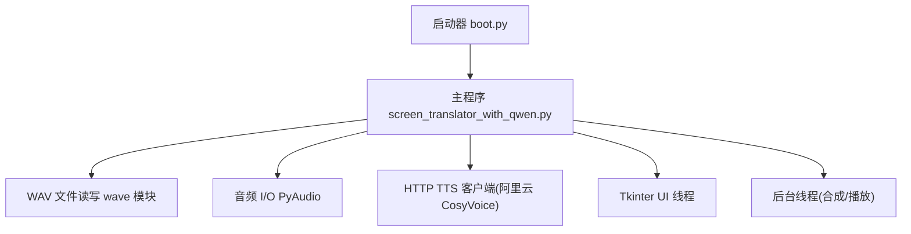
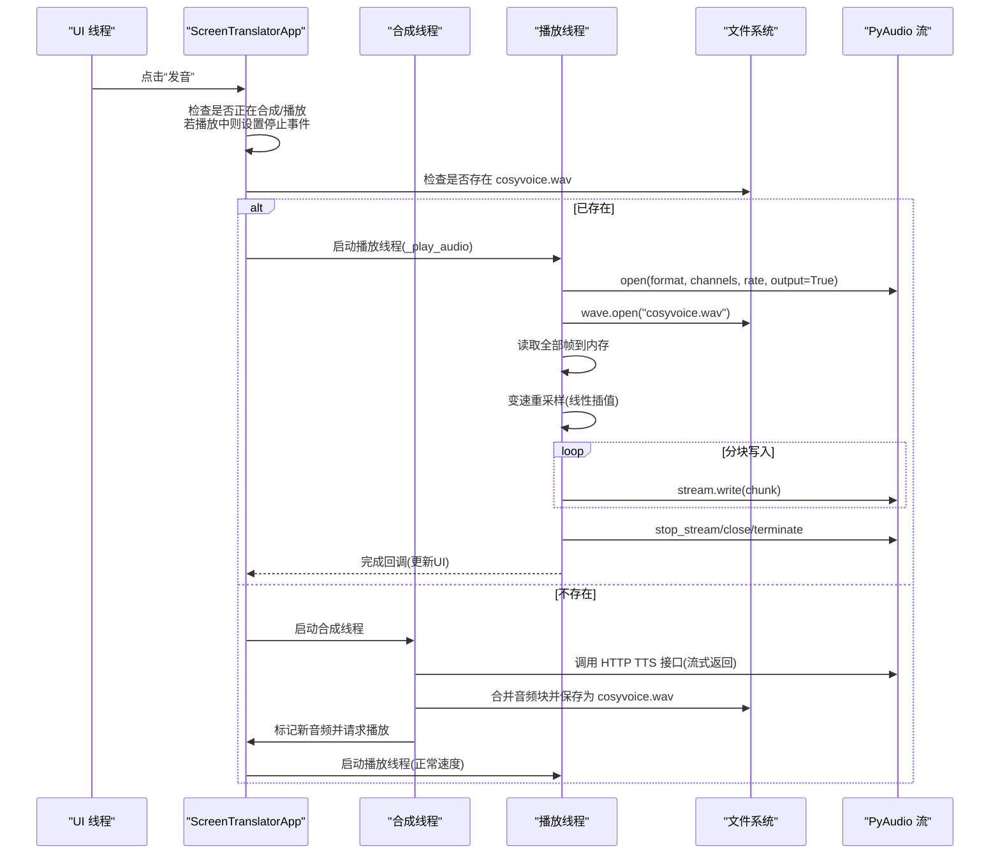
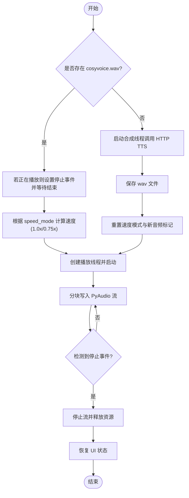
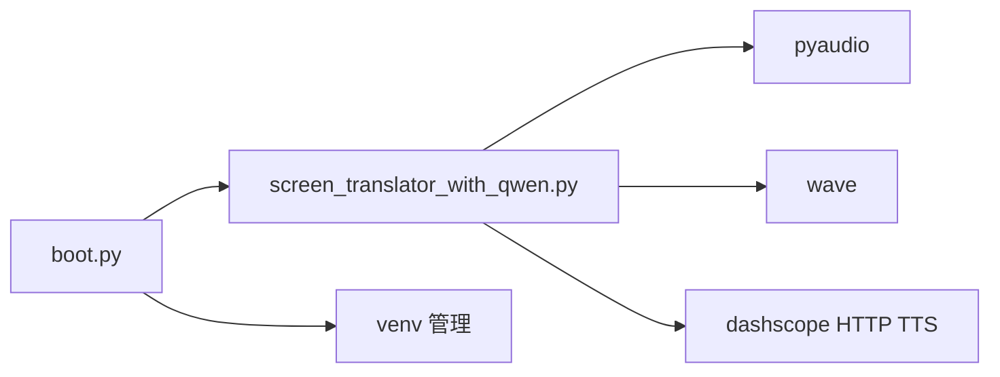

# 音频播放控制

<cite>
**本文引用的文件**
- [screen_translator_with_qwen.py](file://screen_translator_with_qwen.py)
- [boot.py](file://boot.py)
- [requirements.txt](file://requirements.txt)
</cite>

## 目录
1. [简介](#简介)
2. [项目结构](#项目结构)
3. [核心组件](#核心组件)
4. [架构总览](#架构总览)
5. [详细组件分析](#详细组件分析)
6. [依赖关系分析](#依赖关系分析)
7. [性能考虑](#性能考虑)
8. [故障排查指南](#故障排查指南)
9. [结论](#结论)
10. [附录](#附录)

## 简介
本文件聚焦于项目中的“音频播放控制”能力，围绕以下目标展开：
- 变速播放算法实现原理（线性插值重采样、样本数据处理与质量优化）
- 音频流管理机制（PyAudio 流的创建、配置与生命周期管理）
- WAV 文件格式处理流程（从读取到内存缓冲再到实时播放）
- 播放状态控制与资源清理（停止事件、线程管理与内存泄漏防护）
- 播放性能优化最佳实践（缓冲区大小调优、CPU 使用率控制与延迟优化）
- 实际代码示例路径与调试技巧

## 项目结构
本项目为屏幕翻译工具，其中包含语音合成与播放功能。与音频播放控制直接相关的逻辑集中在主程序文件中，启动器负责虚拟环境管理与后台运行。

图表来源
- [boot.py:256-279](file://boot.py#L256-L279)
- [screen_translator_with_qwen.py:372-472](file://screen_translator_with_qwen.py#L372-L472)

章节来源
- [boot.py:256-279](file://boot.py#L256-L279)
- [screen_translator_with_qwen.py:372-472](file://screen_translator_with_qwen.py#L372-L472)

## 核心组件
- 播放入口与控制器
  - speak_original_text：触发发音，负责提取原文文本、切换速度模式、停止当前播放并启动新播放任务
  - _play_audio：包装播放函数并在完成后恢复 UI 状态
- 底层播放实现
  - play_cosyvoice_wav：打开 WAV 文件、解析参数、执行变速重采样、分块写入 PyAudio 输出流
- 资源与状态
  - 播放状态标志 playing、合成标志 synthesizing
  - 停止事件 stop_event 用于跨线程中断播放
  - 速度模式 speed_mode 在正常速度与 0.75x 之间循环切换
- 外部依赖
  - wave：WAV 文件读写
  - pyaudio：音频设备与流管理
  - dashscope HTTP TTS：生成 wav 音频数据并落盘

章节来源
- [screen_translator_with_qwen.py:1442-1568](file://screen_translator_with_qwen.py#L1442-L1568)
- [screen_translator_with_qwen.py:372-472](file://screen_translator_with_qwen.py#L372-L472)

## 架构总览
下图展示了从用户点击“发音”到音频输出的完整调用链，包括合成、落盘、播放与线程协作。

图表来源
- [screen_translator_with_qwen.py:1442-1568](file://screen_translator_with_qwen.py#L1442-L1568)
- [screen_translator_with_qwen.py:372-472](file://screen_translator_with_qwen.py#L372-L472)

## 详细组件分析

### 变速播放算法（线性插值重采样）
- 输入：原始样本数组 samples（按声道交错存储），采样率 rate，声道数 channels，位宽 sample_width
- 目标：以速度系数 speed 进行时间缩放，得到新的样本序列
- 核心步骤
  - 计算新样本数量 num_new_samples = floor(num_samples / speed)
  - 对每个新样本位置 i，映射回原位置 orig_pos = i * speed
  - 取 floor_pos = floor(orig_pos)，frac = orig_pos - floor_pos
  - 对每个声道 ch，取相邻样本 val1、val2，线性插值得 new_val = val1*(1-frac) + val2*frac
  - 根据位宽限制范围：16bit 时 [-32768, 32767]，8bit 时 [0, 255]
- 复杂度
  - 时间复杂度 O(N')，N' 为新样本数；空间复杂度 O(N') 用于存放新样本
- 质量优化建议
  - 将线性插值升级为更高阶插值（如三次样条或 Lanczos）以降低高频失真
  - 在极端变速下引入抗混叠低通滤波，避免频谱折叠
  - 多声道并行化与向量化（NumPy）减少 Python 层循环开销

章节来源
- [screen_translator_with_qwen.py:413-450](file://screen_translator_with_qwen.py#L413-L450)

### 音频流管理机制（PyAudio）
- 初始化与打开
  - 通过 PyAudio().open(...) 创建输出流，格式由 sample_width 推导，channels 与 rate 来自 WAV 头
- 生命周期
  - 播放前：open(...)
  - 播放中：stream.write(chunk) 分块写入
  - 播放后：stop_stream() -> close() -> terminate()
- 错误与异常
  - 捕获异常并记录日志，确保即使出错也能释放资源
- 并发与线程
  - 播放线程独立于 UI 线程，避免阻塞界面响应
  - 使用 Event 对象实现跨线程的停止信号

章节来源
- [screen_translator_with_qwen.py:383-472](file://screen_translator_with_qwen.py#L383-L472)

### WAV 文件处理流程（读取→内存→播放）
- 读取
  - 使用 wave.open(..., 'rb') 获取参数与帧数据
  - 循环 readframes(chunk_size) 将所有帧读入内存列表，再拼接为字节串
- 解码
  - 依据 sample_width 选择 struct 格式字符串，将字节串解包为样本数组
- 变速
  - 当 speed != 1.0 时执行线性插值重采样，生成新样本数组
- 编码与播放
  - 将样本数组打包为字节串，按固定 chunk_size 分块写入 PyAudio 流
- 清理
  - 关闭流与 PyAudio 实例，关闭文件句柄

章节来源
- [screen_translator_with_qwen.py:383-472](file://screen_translator_with_qwen.py#L383-L472)

### 播放状态控制与资源清理
- 状态变量
  - playing：是否正在播放
  - synthesizing：是否正在合成
  - play_stop_event：跨线程停止信号
  - speed_mode：速度模式循环切换（1.0x ↔ 0.75x）
- 停止机制
  - 再次触发发音时，先 set(stop_event) 并 join 旧播放线程（带超时），再启动新线程
- 资源清理
  - 播放结束后 stop_stream/close/terminate
  - 程序退出时清理临时 WAV 文件（atexit 注册）
  - 窗口关闭时统一清理

章节来源
- [screen_translator_with_qwen.py:487-495](file://screen_translator_with_qwen.py#L487-L495)
- [screen_translator_with_qwen.py:1458-1495](file://screen_translator_with_qwen.py#L1458-L1495)
- [screen_translator_with_qwen.py:363-371](file://screen_translator_with_qwen.py#L363-L371)

### 关键流程图（播放控制）

图表来源
- [screen_translator_with_qwen.py:1442-1568](file://screen_translator_with_qwen.py#L1442-L1568)
- [screen_translator_with_qwen.py:372-472](file://screen_translator_with_qwen.py#L372-L472)

## 依赖关系分析
- 运行时依赖
  - pyaudio：音频 I/O 后端
  - wave：标准库 WAV 文件处理
  - dashscope.audio.http_tts：HTTP TTS 客户端（CosyVoice）
- 启动与环境
  - boot.py 自动检测唯一 .py 主程序，维护 venv 并后台启动目标程序
- 依赖安装
  - requirements.txt 声明第三方依赖，boot.py 支持增量更新与失败重试

图表来源
- [boot.py:256-279](file://boot.py#L256-L279)
- [screen_translator_with_qwen.py:372-472](file://screen_translator_with_qwen.py#L372-L472)

章节来源
- [boot.py:256-279](file://boot.py#L256-L279)
- [requirements.txt](file://requirements.txt)

## 性能考虑
- 缓冲区大小调优
  - 当前实现采用固定 chunk_size 分块写入，建议根据系统延迟与 CPU 负载调整，典型范围 512–4096 字节
  - 过小的块会增加 write 调用次数，增大调度开销；过大可能增加首帧延迟
- CPU 使用率控制
  - 线性插值在 Python 层逐样本循环，CPU 占用较高；可迁移至 NumPy 向量化或 C/C++ 扩展
  - 对于长音频，考虑流式重采样而非一次性加载全量数据到内存
- 延迟优化
  - 降低 frames_per_buffer（若改为流式播放）可减少端到端延迟
  - 预取与双缓冲策略可降低卡顿风险
- 内存管理
  - 大文件一次性读入内存可能导致峰值内存升高；建议分段读取与边读边播
  - 及时关闭 wave 与 PyAudio 实例，避免句柄泄漏
- 音质权衡
  - 线性插值简单高效但会引入轻微失真；高质量场景建议使用高阶插值或专业重采样库
  - 变速幅度越大，失真越明显；必要时加入抗混叠滤波

[本节为通用指导，不直接分析具体文件]

## 故障排查指南
- 常见问题
  - 无声音或报错：检查 PyAudio 后端可用性与默认输出设备
  - 播放卡顿：增大缓冲区或降低重采样复杂度
  - 无法停止：确认 stop_event 是否正确设置且播放循环有检查点
  - 文件未清理：确认 atexit 与窗口关闭回调是否生效
- 定位方法
  - 查看应用内日志窗口与 boot.log，关注“音频播放失败/完成”等关键字
  - 在播放循环与资源释放处添加断点或日志，验证执行路径
- 修复建议
  - 确保每次播放都进入 finally 分支进行资源释放
  - 在 UI 线程外操作 PyAudio，避免 Tkinter 线程安全问题
  - 对网络合成失败进行重试与降级提示

章节来源
- [screen_translator_with_qwen.py:372-472](file://screen_translator_with_qwen.py#L372-L472)
- [screen_translator_with_qwen.py:1442-1568](file://screen_translator_with_qwen.py#L1442-L1568)
- [boot.py:256-279](file://boot.py#L256-L279)

## 结论
本项目实现了基于 PyAudio 与 wave 的 WAV 播放控制，具备基础的变速播放能力。其优势在于实现简洁、易于集成；改进方向包括：
- 用更高效的插值算法与向量化实现提升音质与性能
- 引入流式重采样与双缓冲以降低延迟与内存峰值
- 完善错误恢复与资源清理策略，增强健壮性

[本节为总结，不直接分析具体文件]

## 附录

### 关键实现路径参考
- 播放入口与状态控制
  - [speak_original_text:1442-1568](file://screen_translator_with_qwen.py#L1442-L1568)
  - [_play_audio:1558-1568](file://screen_translator_with_qwen.py#L1558-L1568)
- 底层播放与变速
  - [play_cosyvoice_wav:372-472](file://screen_translator_with_qwen.py#L372-L472)
- 资源清理
  - [cleanup_cosyvoice_wav:363-371](file://screen_translator_with_qwen.py#L363-L371)
- 启动器与环境管理
  - [boot.py 主流程:256-279](file://boot.py#L256-279)