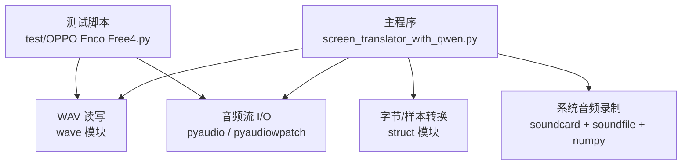
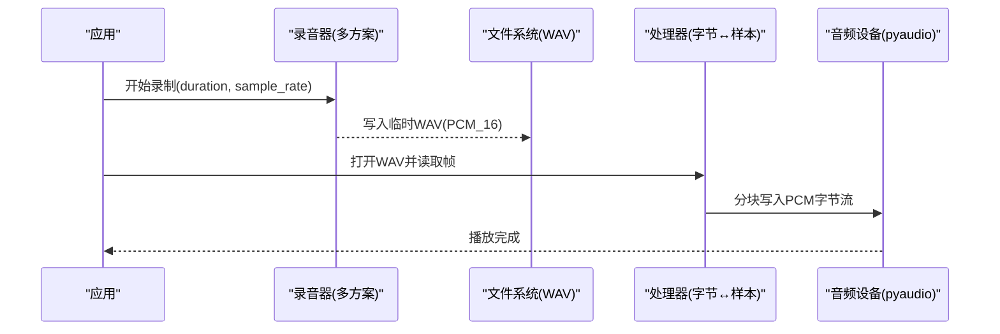
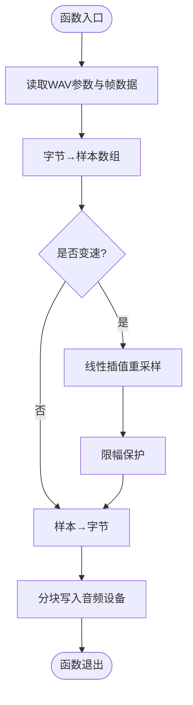
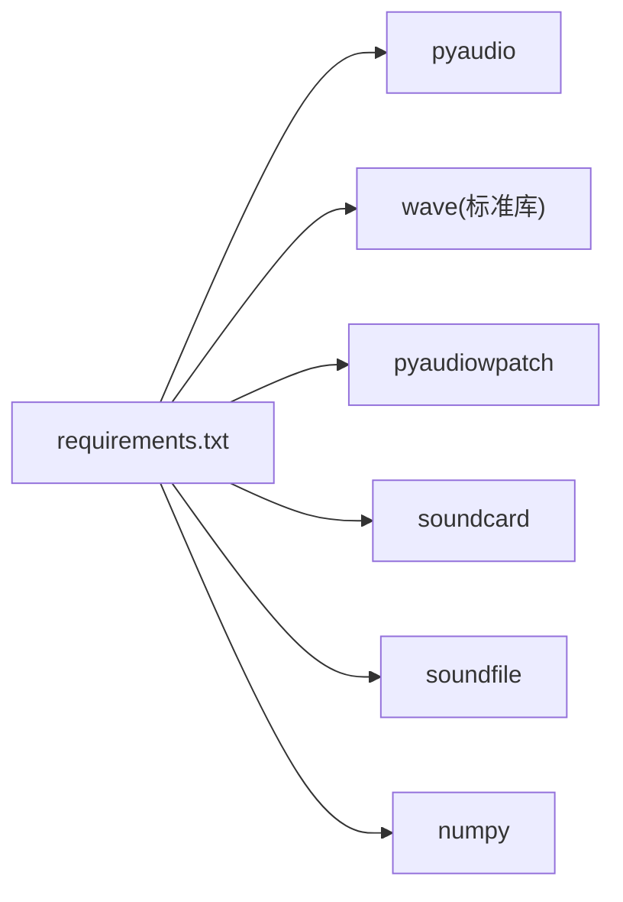

# 音频格式处理

<cite>
**本文引用的文件**   
- [screen_translator_with_qwen.py](file://screen_translator_with_qwen.py)
- [OPPO Enco Free4.py](file://test/OPPO Enco Free4.py)
- [requirements.txt](file://requirements.txt)
</cite>

## 目录
1. [简介](#简介)
2. [项目结构](#项目结构)
3. [核心组件](#核心组件)
4. [架构总览](#架构总览)
5. [详细组件分析](#详细组件分析)
6. [依赖关系分析](#依赖关系分析)
7. [性能考虑](#性能考虑)
8. [故障排查指南](#故障排查指南)
9. [结论](#结论)
10. [附录](#附录)

## 简介
本文件围绕仓库中的音频处理实现，系统化阐述 WAV 文件格式与 PCM 样本数据的处理方法，包括：
- WAV 文件头解析、数据块读取与元信息提取
- 字节数组操作技术（打包/解包、类型转换、内存布局）
- 音频样本数据处理（有符号/无符号整数、多声道、采样率变换）
- 音频格式间转换机制（PCM 与字节序列互转、位深度、声道数调整）
- 数据验证与质量检查（完整性校验、异常值检测）
- 具体代码示例路径与性能优化建议

## 项目结构
本项目包含一个主程序与若干测试脚本。与音频处理直接相关的核心逻辑集中在主程序中，用于系统音频录制、WAV 读写、播放与变速重采样；测试脚本演示了使用 WASAPI 环回设备录制并保存为 WAV 的完整流程。

图表来源
- [screen_translator_with_qwen.py:372-472](file://screen_translator_with_qwen.py#L372-L472)
- [screen_translator_with_qwen.py:1806-1851](file://screen_translator_with_qwen.py#L1806-L1851)
- [OPPO Enco Free4.py:1-47](file://test/OPPO Enco Free4.py#L1-L47)

章节来源
- [screen_translator_with_qwen.py:372-472](file://screen_translator_with_qwen.py#L372-L472)
- [OPPO Enco Free4.py:1-47](file://test/OPPO Enco Free4.py#L1-L47)

## 核心组件
- WAV 播放与变速重采样：从 WAV 文件中读取帧数据，转换为样本数组，进行线性插值变速，再打包为字节流输出到音频设备。
- 系统音频录制：提供三种方案（soundcard、pyaudiowpatch、pyaudio），将采集到的 PCM 数据写入临时 WAV 文件，供后续识别或处理。
- 字节与样本互转：使用 struct 对 16bit 有符号整型与 8bit 无符号整型进行批量打包/解包，支持单声道与多声道交错排列。
- 元信息获取：通过 wave 接口获取采样率、声道数、位深等元信息，作为后续处理的依据。

章节来源
- [screen_translator_with_qwen.py:372-472](file://screen_translator_with_qwen.py#L372-L472)
- [screen_translator_with_qwen.py:1806-1851](file://screen_translator_with_qwen.py#L1806-L1851)
- [OPPO Enco Free4.py:1-47](file://test/OPPO Enco Free4.py#L1-L47)

## 架构总览
下图展示了“录制—存储—处理—播放”的整体流程，以及各模块之间的交互关系。

图表来源
- [screen_translator_with_qwen.py:1806-1851](file://screen_translator_with_qwen.py#L1806-L1851)
- [screen_translator_with_qwen.py:372-472](file://screen_translator_with_qwen.py#L372-L472)

## 详细组件分析

### WAV 文件结构与处理
- 文件头解析与元信息提取
  - 通过 wave 接口获取采样率、声道数、位深等信息，用于后续解码与播放配置。
  - 参考路径：[screen_translator_with_qwen.py:387-395](file://screen_translator_with_qwen.py#L387-L395)
- 数据块读取
  - 以固定大小分块读取帧数据，避免一次性加载大文件导致内存峰值过高。
  - 参考路径：[screen_translator_with_qwen.py:397-405](file://screen_translator_with_qwen.py#L397-L405)
- 字节序列与样本数组互转
  - 根据位深选择格式符：16bit 使用有符号短整型，8bit 使用无符号字节。
  - 参考路径：[screen_translator_with_qwen.py:408-411](file://screen_translator_with_qwen.py#L408-L411)、[screen_translator_with_qwen.py:452-454](file://screen_translator_with_qwen.py#L452-L454)

章节来源
- [screen_translator_with_qwen.py:387-411](file://screen_translator_with_qwen.py#L387-L411)
- [screen_translator_with_qwen.py:452-454](file://screen_translator_with_qwen.py#L452-L454)

### 字节数组操作技术
- 打包/解包策略
  - 使用 struct 的 pack/unpack 对连续 PCM 字节进行批量转换，提升效率。
  - 参考路径：[screen_translator_with_qwen.py:408-411](file://screen_translator_with_qwen.py#L408-L411)、[screen_translator_with_qwen.py:452-454](file://screen_translator_with_qwen.py#L452-L454)
- 数据类型转换
  - 16bit 有符号范围 [-32768, 32767]，8bit 无符号范围 [0, 255]，在变速后需做限幅保护。
  - 参考路径：[screen_translator_with_qwen.py:441-444](file://screen_translator_with_qwen.py#L441-L444)
- 内存布局优化
  - 按帧大小分块拼接字节串，减少中间对象数量；播放时按通道数计算 chunk 步长。
  - 参考路径：[screen_translator_with_qwen.py:397-405](file://screen_translator_with_qwen.py#L397-L405)、[screen_translator_with_qwen.py:456-462](file://screen_translator_with_qwen.py#L456-L462)

章节来源
- [screen_translator_with_qwen.py:408-411](file://screen_translator_with_qwen.py#L408-L411)
- [screen_translator_with_qwen.py:441-444](file://screen_translator_with_qwen.py#L441-L444)
- [screen_translator_with_qwen.py:397-405](file://screen_translator_with_qwen.py#L397-L405)
- [screen_translator_with_qwen.py:456-462](file://screen_translator_with_qwen.py#L456-L462)

### 音频样本数据处理
- 有符号/无符号整数转换
  - 16bit 有符号整型用于高质量 PCM；8bit 无符号整型用于低精度场景。
  - 参考路径：[screen_translator_with_qwen.py:408-411](file://screen_translator_with_qwen.py#L408-L411)
- 多声道数据处理
  - 多声道采用交错排列，索引计算需乘以通道数；插值时需逐声道处理。
  - 参考路径：[screen_translator_with_qwen.py:428-446](file://screen_translator_with_qwen.py#L428-L446)
- 采样率转换（变速）
  - 基于线性插值的简单变速算法，按速度因子映射新样本位置，并对边界进行保护。
  - 参考路径：[screen_translator_with_qwen.py:414-450](file://screen_translator_with_qwen.py#L414-L450)

章节来源
- [screen_translator_with_qwen.py:408-411](file://screen_translator_with_qwen.py#L408-L411)
- [screen_translator_with_qwen.py:414-450](file://screen_translator_with_qwen.py#L414-L450)

### 音频格式转换机制
- PCM 与字节序列互转
  - 使用 struct 统一格式符，确保字节序与数据类型一致。
  - 参考路径：[screen_translator_with_qwen.py:408-411](file://screen_translator_with_qwen.py#L408-L411)、[screen_translator_with_qwen.py:452-454](file://screen_translator_with_qwen.py#L452-L454)
- 位深度处理
  - 根据位深选择不同格式符与限幅范围，防止溢出。
  - 参考路径：[screen_translator_with_qwen.py:441-444](file://screen_translator_with_qwen.py#L441-L444)
- 声道数调整
  - 当前实现保持原声道数不变；如需降/升声道，可在样本数组阶段进行混音或复制。

章节来源
- [screen_translator_with_qwen.py:408-411](file://screen_translator_with_qwen.py#L408-L411)
- [screen_translator_with_qwen.py:441-444](file://screen_translator_with_qwen.py#L441-L444)

### 系统音频录制与保存
- 多方案录制
  - 方案一：soundcard + soundfile + numpy，适合内置扬声器/有线耳机。
  - 方案二：pyaudiowpatch 的 WASAPI 环回，支持蓝牙耳机。
  - 方案三：pyaudio 立体声混音，需要系统设置启用。
- 保存为 WAV
  - 使用 wave 写入 PCM_16 数据，设置声道数、位深与采样率。
  - 参考路径：[screen_translator_with_qwen.py:1806-1851](file://screen_translator_with_qwen.py#L1806-L1851)、[screen_translator_with_qwen.py:1943-2068](file://screen_translator_with_qwen.py#L1943-L2068)、[OPPO Enco Free4.py:1-47](file://test/OPPO Enco Free4.py#L1-L47)

章节来源
- [screen_translator_with_qwen.py:1806-1851](file://screen_translator_with_qwen.py#L1806-L1851)
- [screen_translator_with_qwen.py:1943-2068](file://screen_translator_with_qwen.py#L1943-L2068)
- [OPPO Enco Free4.py:1-47](file://test/OPPO Enco Free4.py#L1-L47)

### 变速重采样流程图

图表来源
- [screen_translator_with_qwen.py:372-472](file://screen_translator_with_qwen.py#L372-L472)

## 依赖关系分析
- 运行时依赖
  - pyaudio：音频播放与部分录制能力
  - wave：WAV 文件读写
  - pyaudiowpatch：Windows WASAPI 环回录制（支持蓝牙耳机）
  - soundcard/soundfile/numpy：跨平台系统音频录制与数值处理
- 依赖安装清单见 requirements.txt。

图表来源
- [requirements.txt:1-31](file://requirements.txt#L1-L31)

章节来源
- [requirements.txt:1-31](file://requirements.txt#L1-L31)

## 性能考虑
- 分块 I/O
  - 读取与播放均采用固定大小的分块策略，降低内存占用并提高吞吐。
  - 参考路径：[screen_translator_with_qwen.py:397-405](file://screen_translator_with_qwen.py#L397-L405)、[screen_translator_with_qwen.py:456-462](file://screen_translator_with_qwen.py#L456-L462)
- 批量转换
  - 使用 struct 的批量 pack/unpack 替代循环逐个元素转换，显著降低 Python 层开销。
  - 参考路径：[screen_translator_with_qwen.py:408-411](file://screen_translator_with_qwen.py#L408-L411)、[screen_translator_with_qwen.py:452-454](file://screen_translator_with_qwen.py#L452-L454)
- 插值算法
  - 当前使用线性插值，简单高效；若追求更高音质可引入更高级的重采样算法（如 sinc 插值）。
  - 参考路径：[screen_translator_with_qwen.py:414-450](file://screen_translator_with_qwen.py#L414-L450)
- 限幅与溢出防护
  - 在变速后对样本值进行限幅，避免超出位深范围造成失真。
  - 参考路径：[screen_translator_with_qwen.py:441-444](file://screen_translator_with_qwen.py#L441-L444)

## 故障排查指南
- 无法找到 WASAPI 环回设备
  - 现象：提示未找到环回设备或访问被拒绝。
  - 可能原因：非 Windows 环境、驱动不支持、蓝牙耳机限制。
  - 解决建议：安装 pyaudiowpatch，切换到内置扬声器或有线耳机。
  - 参考路径：[screen_translator_with_qwen.py:1943-1968](file://screen_translator_with_qwen.py#L1943-L1968)
- 音频格式不支持
  - 现象：错误码指示格式不支持。
  - 解决建议：确认采样率与位深匹配，尝试 paInt16。
  - 参考路径：[screen_translator_with_qwen.py:1935-1941](file://screen_translator_with_qwen.py#L1935-L1941)
- 立体声混音不可用
  - 现象：pyaudio 录制失败。
  - 解决建议：在系统声音控制面板中启用“立体声混音”。
  - 参考路径：[screen_translator_with_qwen.py:1828-1851](file://screen_translator_with_qwen.py#L1828-L1851)
- 播放无声或爆音
  - 现象：播放无声或出现爆音。
  - 排查要点：检查限幅是否正确、位深与格式符是否匹配、chunk 大小是否与通道数对齐。
  - 参考路径：[screen_translator_with_qwen.py:441-444](file://screen_translator_with_qwen.py#L441-L444)、[screen_translator_with_qwen.py:456-462](file://screen_translator_with_qwen.py#L456-L462)

章节来源
- [screen_translator_with_qwen.py:1828-1851](file://screen_translator_with_qwen.py#L1828-L1851)
- [screen_translator_with_qwen.py:1935-1941](file://screen_translator_with_qwen.py#L1935-L1941)
- [screen_translator_with_qwen.py:1943-1968](file://screen_translator_with_qwen.py#L1943-L1968)
- [screen_translator_with_qwen.py:441-444](file://screen_translator_with_qwen.py#L441-L444)
- [screen_translator_with_qwen.py:456-462](file://screen_translator_with_qwen.py#L456-L462)

## 结论
本项目实现了完整的系统音频录制、WAV 读写与播放链路，并在播放环节提供了简单的变速重采样能力。通过合理的分块 I/O、批量字节/样本转换与限幅保护，系统在易用性与性能之间取得了平衡。针对蓝牙耳机的兼容性，提供了基于 WASAPI 环回的备选方案。未来可在重采样算法、动态声道数转换与更完善的音频质量校验方面进一步优化。

## 附录

### 关键实现路径速查
- WAV 播放与变速重采样
  - [screen_translator_with_qwen.py:372-472](file://screen_translator_with_qwen.py#L372-L472)
- 系统音频录制（多方案）
  - [screen_translator_with_qwen.py:1806-1851](file://screen_translator_with_qwen.py#L1806-L1851)
  - [screen_translator_with_qwen.py:1943-2068](file://screen_translator_with_qwen.py#L1943-L2068)
- 使用 WASAPI 环回录制并保存 WAV（测试脚本）
  - [OPPO Enco Free4.py:1-47](file://test/OPPO Enco Free4.py#L1-L47)
- 依赖清单
  - [requirements.txt:1-31](file://requirements.txt#L1-L31)