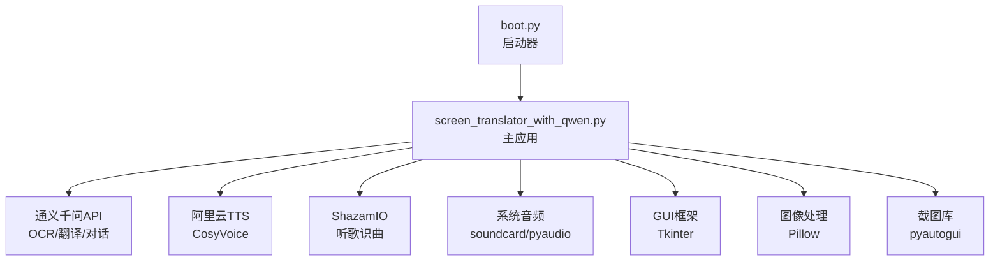
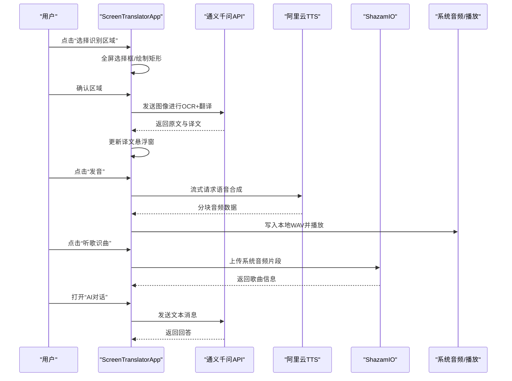
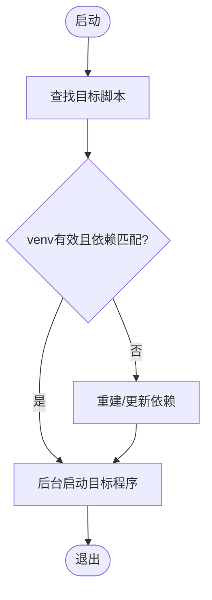
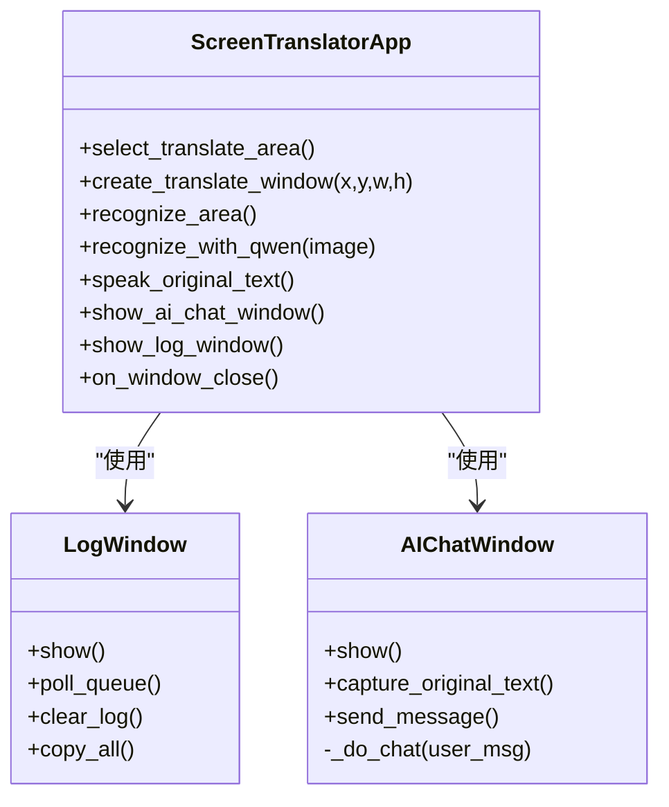
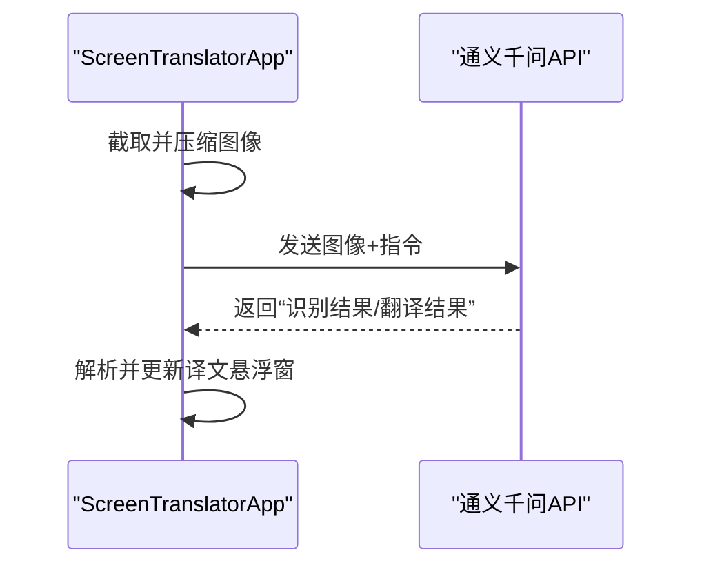
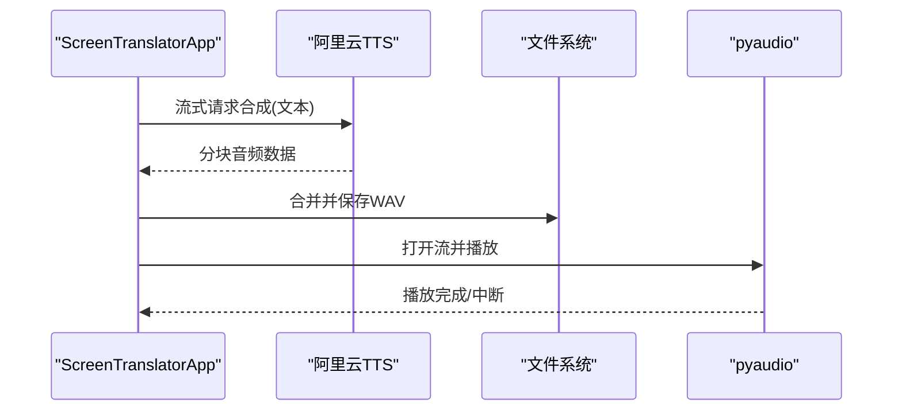
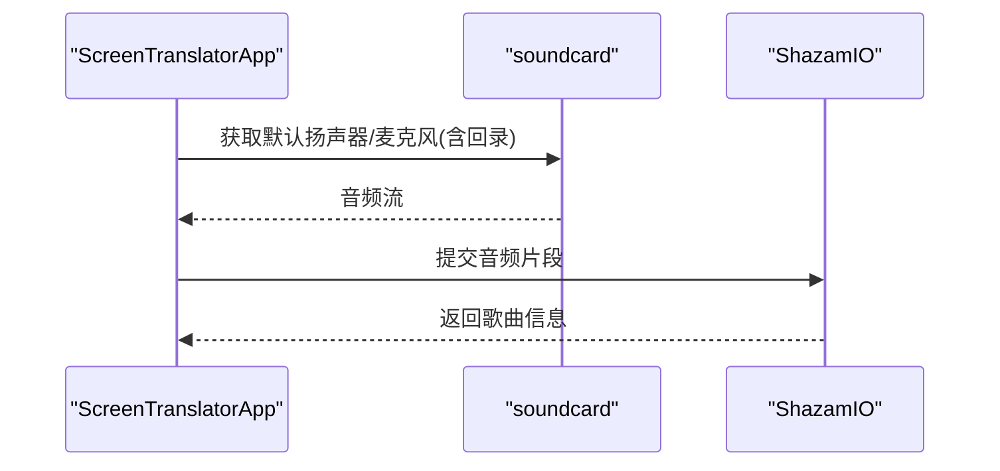
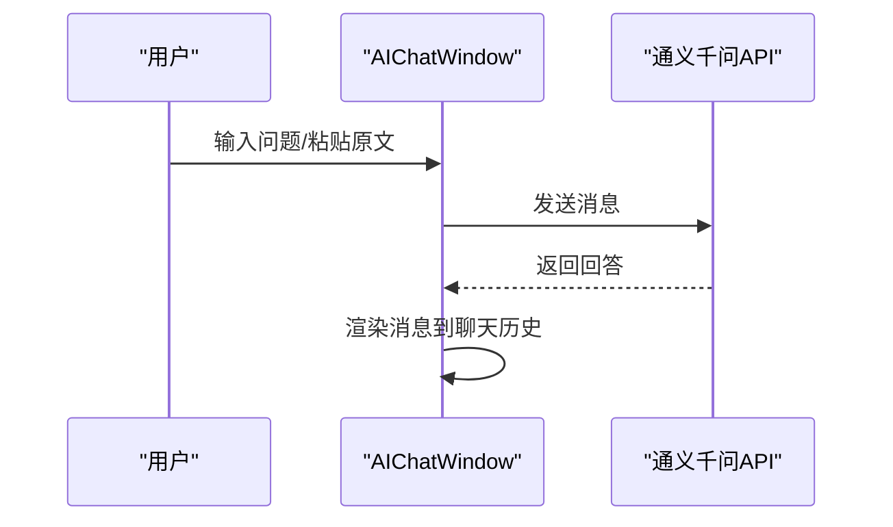
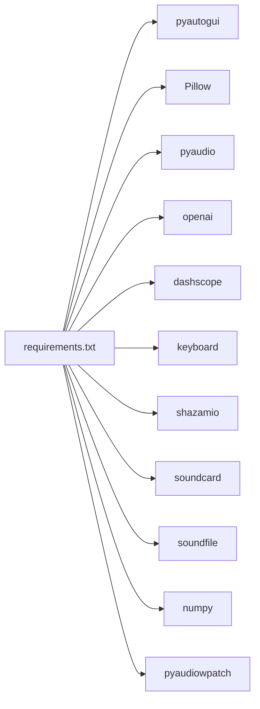

# 项目概述

<cite>
**本文引用的文件**   
- [screen_translator_with_qwen.py](file://screen_translator_with_qwen.py)
- [boot.py](file://boot.py)
- [requirements.txt](file://requirements.txt)
- [test/screen_translaor_2.0.py](file://test/screen_translaor_2.0.py)
- [test/qwen_ocr.py](file://test/qwen_ocr.py)
- [test/cosyvoice.py](file://test/cosyvoice.py)
- [test/shazam_test.py](file://test/shazam_test.py)
</cite>

## 目录
1. [简介](#简介)
2. [项目结构](#项目结构)
3. [核心组件](#核心组件)
4. [架构总览](#架构总览)
5. [详细组件分析](#详细组件分析)
6. [依赖关系分析](#依赖关系分析)
7. [性能与并发特性](#性能与并发特性)
8. [故障排查指南](#故障排查指南)
9. [结论](#结论)
10. [附录：技术栈概览](#附录技术栈概览)

## 简介
本项目是一个基于 Python 和 Tkinter 的桌面端“屏幕翻译工具 2.0”，围绕“截图识别—实时翻译—语音合成—听歌识曲—AI对话”等智能能力构建。整体采用模块化架构、事件驱动模式与多线程处理机制，集成通义千问（DashScope）OCR/翻译/对话、阿里云 TTS 语音合成、Shazam 音乐识别、系统音频录制与播放等第三方服务，提供开箱即用的跨平台桌面体验。

## 项目结构
仓库根目录包含启动器、主程序与测试示例：
- 启动器 boot.py：自动检测并运行同目录下唯一的主程序，负责虚拟环境校验、依赖安装与后台启动。
- 主程序 screen_translator_with_qwen.py：实现完整的 GUI、区域选择、OCR+翻译、TTS 发音、听歌识曲、AI 对话等功能。
- requirements.txt：声明全部运行时依赖。
- test 目录：提供若干独立示例脚本，用于验证 OCR、TTS、Shazam 等能力。

图表来源
- [boot.py:1-279](file://boot.py#L1-L279)
- [screen_translator_with_qwen.py:1-120](file://screen_translator_with_qwen.py#L1-L120)

章节来源
- [boot.py:1-279](file://boot.py#L1-L279)
- [screen_translator_with_qwen.py:1-120](file://screen_translator_with_qwen.py#L1-L120)
- [requirements.txt:1-31](file://requirements.txt#L1-L31)

## 核心组件
- 启动器模块（boot.py）
  - 自动发现目标脚本、创建/校验虚拟环境、增量更新依赖、无控制台后台启动目标程序。
- 主应用模块（ScreenTranslatorApp）
  - 区域选择与悬浮窗口管理（识别区/译文区）。
  - OCR 与翻译流程（调用通义千问多模态模型）。
  - 语音合成与播放（阿里云 CosyVoice + pyaudio）。
  - 听歌识曲（ShazamIO + 系统音频录制）。
  - AI 对话窗口（通义千问文本对话）。
  - 日志窗口与全局快捷键。
- 辅助类
  - LogWindow：异步日志显示。
  - AIChatWindow：独立的对话界面，支持捕获原文缓存内容。

章节来源
- [boot.py:1-279](file://boot.py#L1-L279)
- [screen_translator_with_qwen.py:474-634](file://screen_translator_with_qwen.py#L474-L634)
- [screen_translator_with_qwen.py:21-100](file://screen_translator_with_qwen.py#L21-L100)
- [screen_translator_with_qwen.py:101-300](file://screen_translator_with_qwen.py#L101-L300)

## 架构总览
系统以事件驱动为核心：用户交互触发区域选择、识别、翻译、发音或对话；各耗时任务在独立线程中执行，通过队列/回调安全更新 UI。外部服务通过 SDK 或 HTTP 接口接入，统一由 API Key 配置管理。

图表来源
- [screen_translator_with_qwen.py:635-713](file://screen_translator_with_qwen.py#L635-L713)
- [screen_translator_with_qwen.py:978-1001](file://screen_translator_with_qwen.py#L978-L1001)
- [screen_translator_with_qwen.py:1493-1553](file://screen_translator_with_qwen.py#L1493-L1553)
- [test/shazam_test.py:1-66](file://test/shazam_test.py#L1-L66)
- [test/qwen_ocr.py:1-30](file://test/qwen_ocr.py#L1-L30)
- [test/cosyvoice.py:1-40](file://test/cosyvoice.py#L1-L40)

## 详细组件分析

### 启动器（boot.py）
- 功能要点
  - 自动扫描同级 .py 文件，确定唯一目标脚本。
  - 校验 venv 有效性、对比 requirements.txt 哈希，必要时重建或增量更新。
  - 使用子进程后台启动目标程序（Windows 隐藏控制台），完成后退出。
- 关键流程
  - 检查/清理日志 → 定位目标脚本 → 确保 venv 有效 → 安装/更新依赖 → 后台启动目标程序。

图表来源
- [boot.py:53-70](file://boot.py#L53-L70)
- [boot.py:105-166](file://boot.py#L105-L166)
- [boot.py:168-208](file://boot.py#L168-L208)
- [boot.py:209-253](file://boot.py#L209-L253)

章节来源
- [boot.py:1-279](file://boot.py#L1-L279)

### 主应用（ScreenTranslatorApp）
- 界面与交互
  - 主窗口提供“选择译文区域/识别区域/中止/关闭/日志/听歌识曲/AI对话/快捷键设置”等按钮。
  - 译文悬浮窗支持拖动、滚动、状态提示与“发音”快捷按钮。
- 区域选择
  - 全屏半透明覆盖层 + Canvas 绘制选择框，记录坐标后生成对应悬浮窗。
- OCR 与翻译
  - 截取选定区域 → 压缩增强 → 调用通义千问多模态模型 → 解析“识别结果/翻译结果” → 更新译文窗。
- 语音合成与播放
  - 提取原文部分 → 调用阿里云 TTS 流式合成 → 保存 WAV → 使用 pyaudio 播放，支持变速。
- 听歌识曲
  - 可选依赖检测 → 使用 soundcard/soundfile/numpy 采集系统音频 → 调用 ShazamIO 识别。
- AI 对话
  - 独立对话框，支持从 OCR 缓存抓取原文作为上下文，调用通义千问文本模型。

图表来源
- [screen_translator_with_qwen.py:474-634](file://screen_translator_with_qwen.py#L474-L634)
- [screen_translator_with_qwen.py:714-780](file://screen_translator_with_qwen.py#L714-L780)
- [screen_translator_with_qwen.py:21-100](file://screen_translator_with_qwen.py#L21-L100)
- [screen_translator_with_qwen.py:101-300](file://screen_translator_with_qwen.py#L101-L300)

章节来源
- [screen_translator_with_qwen.py:474-634](file://screen_translator_with_qwen.py#L474-L634)
- [screen_translator_with_qwen.py:635-713](file://screen_translator_with_qwen.py#L635-L713)
- [screen_translator_with_qwen.py:714-780](file://screen_translator_with_qwen.py#L714-L780)
- [screen_translator_with_qwen.py:1442-1553](file://screen_translator_with_qwen.py#L1442-L1553)
- [screen_translator_with_qwen.py:2398-2416](file://screen_translator_with_qwen.py#L2398-L2416)

### OCR 与翻译流程（通义千问）
- 输入：选定区域的截图（经对比度增强与灰度化压缩）。
- 处理：调用 DashScope 兼容 OpenAI 接口的多模态模型，返回结构化文本（识别结果/翻译结果）。
- 输出：在译文悬浮窗展示“译文 + 原文”。

图表来源
- [screen_translator_with_qwen.py:978-1001](file://screen_translator_with_qwen.py#L978-L1001)
- [screen_translator_with_qwen.py:1174-1200](file://screen_translator_with_qwen.py#L1174-L1200)
- [test/qwen_ocr.py:1-30](file://test/qwen_ocr.py#L1-L30)

章节来源
- [screen_translator_with_qwen.py:978-1001](file://screen_translator_with_qwen.py#L978-L1001)
- [screen_translator_with_qwen.py:1174-1200](file://screen_translator_with_qwen.py#L1174-L1200)
- [test/qwen_ocr.py:1-30](file://test/qwen_ocr.py#L1-L30)

### 语音合成与播放（阿里云 TTS + pyaudio）
- 输入：译文悬浮窗中的“原文”部分。
- 处理：调用阿里云 CosyVoice 流式合成，收集音频块并保存为 WAV。
- 播放：使用 pyaudio 读取 WAV，支持变速播放与停止控制。

图表来源
- [screen_translator_with_qwen.py:1493-1553](file://screen_translator_with_qwen.py#L1493-L1553)
- [test/cosyvoice.py:1-40](file://test/cosyvoice.py#L1-L40)

章节来源
- [screen_translator_with_qwen.py:1493-1553](file://screen_translator_with_qwen.py#L1493-L1553)
- [test/cosyvoice.py:1-40](file://test/cosyvoice.py#L1-L40)

### 听歌识曲（ShazamIO + 系统音频）
- 输入：系统音频（支持默认扬声器回录，含蓝牙耳机场景）。
- 处理：使用 soundcard/soundfile/numpy 采集音频片段，调用 ShazamIO 识别。
- 输出：歌曲名、艺术家、封面图链接等信息。

图表来源
- [screen_translator_with_qwen.py:314-336](file://screen_translator_with_qwen.py#L314-L336)
- [test/shazam_test.py:1-66](file://test/shazam_test.py#L1-L66)

章节来源
- [screen_translator_with_qwen.py:314-336](file://screen_translator_with_qwen.py#L314-L336)
- [test/shazam_test.py:1-66](file://test/shazam_test.py#L1-L66)

### AI 对话窗口
- 功能：独立对话框，支持 Ctrl+Enter 发送、捕获原文缓存、错误提示与重试。
- 集成：通义千问文本模型，按角色渲染消息样式。

图表来源
- [screen_translator_with_qwen.py:101-300](file://screen_translator_with_qwen.py#L101-L300)

章节来源
- [screen_translator_with_qwen.py:101-300](file://screen_translator_with_qwen.py#L101-L300)

## 依赖关系分析
- 运行时依赖（requirements.txt）
  - 截图：pyautogui
  - 图像处理：Pillow
  - 音频播放：pyaudio
  - AI 客户端：openai（兼容 DashScope）
  - 语音合成：dashscope（阿里云 TTS）
  - 键盘监听：keyboard（全局快捷键）
  - 听歌识曲：shazamio、audioop-lts
  - 系统音频录制：soundcard、soundfile、numpy
  - Windows WASAPI 环形回录：pyaudiowpatch
- 可选依赖
  - 若未安装 shazamio/soundcard 等，相关功能将降级不可用并记录警告。

图表来源
- [requirements.txt:1-31](file://requirements.txt#L1-L31)

章节来源
- [requirements.txt:1-31](file://requirements.txt#L1-L31)
- [screen_translator_with_qwen.py:314-336](file://screen_translator_with_qwen.py#L314-L336)

## 性能与并发特性
- 多线程
  - 识别/翻译/TTS/播放均在新线程执行，避免阻塞 UI。
  - 使用 Event 控制播放停止，支持中途切换速度。
- 网络与重试
  - 对 AI 请求具备指数退避与随机抖动策略，针对 429 限频错误进行重试。
- 资源管理
  - 启动时清理旧 WAV 文件，注册 atexit 钩子在退出时清理临时文件。
  - 日志通过队列异步刷新，降低 UI 卡顿。
- 建议优化
  - 对大段文本可考虑分段合成与边合边播，进一步降低首帧延迟。
  - 对频繁截图场景可增加去抖与节流策略。

[本节为通用性能讨论，不直接分析具体文件]

## 故障排查指南
- 常见问题
  - API Key 无效或过期：检查 key.txt 内容与权限。
  - 请求过于频繁（429）：等待数分钟后再试，或降低频率。
  - 请求体过大（413）：缩小识别区域或降低图片质量。
  - 系统音频无法录制：确认 soundcard/pyaudiowpatch 已安装，并在 Windows 上启用“立体声混音/环回”。
  - 蓝牙设备回录异常：尝试使用 pyaudiowpatch 提供的 WASAPI 回录路径。
- 定位方法
  - 打开“日志”窗口查看详细日志。
  - 检查 boot.log 了解启动器行为与依赖安装情况。
  - 使用 test 目录下的示例脚本单独验证 OCR/TTS/Shazam 能力。

章节来源
- [screen_translator_with_qwen.py:21-100](file://screen_translator_with_qwen.py#L21-L100)
- [screen_translator_with_qwen.py:339-360](file://screen_translator_with_qwen.py#L339-L360)
- [boot.py:27-36](file://boot.py#L27-L36)

## 结论
屏幕翻译工具 2.0 以 Tkinter 为 UI 基础，结合通义千问与阿里云 TTS 等云服务，实现了“所见即所得”的屏幕文字识别与翻译体验，并扩展了语音合成、听歌识曲与 AI 对话等实用能力。其模块化设计、事件驱动与多线程并发策略，使系统在易用性与可扩展性之间取得良好平衡。对于初学者，可按需启用功能；对于有经验的开发者，可在现有基础上继续扩展更多 AI 能力与本地化处理。

[本节为总结性内容，不直接分析具体文件]

## 附录：技术栈概览
- GUI 框架：Tkinter
- 截图与图像处理：pyautogui、Pillow
- AI 服务：通义千问（DashScope 兼容 OpenAI 接口）、阿里云 TTS（CosyVoice）
- 音频处理：pyaudio、soundcard、soundfile、numpy、pyaudiowpatch
- 音乐识别：shazamio
- 键盘监听：keyboard
- 启动与环境管理：boot.py（venv 自动管理、依赖增量更新）

章节来源
- [requirements.txt:1-31](file://requirements.txt#L1-L31)
- [boot.py:1-279](file://boot.py#L1-L279)
- [screen_translator_with_qwen.py:1-120](file://screen_translator_with_qwen.py#L1-L120)